<div align="center">

<picture>
  <source media="(prefers-color-scheme: dark)" srcset=".github/assets/wordmark-dark.png">
  
</picture>

<p><b>Design Hyper-V VMs in the browser. Deploy them with PowerShell.</b></p>

<p>


</p>

</div>

## <picture><source media="(prefers-color-scheme: dark)" srcset=".github/assets/icons/vm-dark.png"></picture> Quick start

Elevated PowerShell on a Hyper-V host, a Windows ISO in the `isos\` folder:

```powershell
.\New-Vhdx.ps1                                # build a gold image — pick the ISO, pick an edition
Start-Process .\html\hyperv-vm-studio.html    # design the lab, then Download config.json
.\Build-Vms.ps1                               # menu → Build all VMs
```

A few minutes later the VMs are running and sitting at a login prompt. Passwords are on the
studio's **Passwords** page.

<!-- VIDEO: full run, ISO to login prompt -->

## <picture><source media="(prefers-color-scheme: dark)" srcset=".github/assets/icons/hyperv-dark.png"></picture> What you get

Labs rot. You stand a domain controller up by hand, poke at it for six months, and then the
host needs a reinstall and the whole thing is gone. This repo makes the lab a file: design it
once, rebuild it whenever, throw it away without flinching.

<picture><source media="(prefers-color-scheme: dark)" srcset=".github/assets/pipeline-dark.png">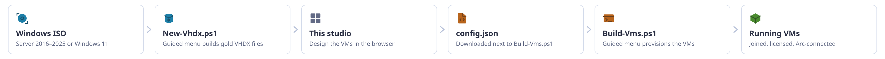</picture>

Three parts, used in that order:

| | |
|---|---|
| <picture><source media="(prefers-color-scheme: dark)" srcset=".github/assets/icons/gold-image-dark.png"></picture> **`New-Vhdx.ps1`** | Turns a Windows ISO into a generalized Gen2 gold image. Server 2016–2025, Windows 11 — including Enterprise multi-session. |
| <picture><source media="(prefers-color-scheme: dark)" srcset=".github/assets/icons/monitor-dark.png"></picture> **The studio** | A single HTML file. Click the lab together — machines, disks, networks, domain join, Windows roles — and download `config.json`. |
| <picture><source media="(prefers-color-scheme: dark)" srcset=".github/assets/icons/powershell-dark.png"></picture> **`Build-Vms.ps1`** | Reads that file on the host. Differencing disks, answer files, VMs created and started. |

What that covers, beyond the obvious:

- **Domain join and Azure Arc onboarding** happen on their own at first boot. You never log in to set them up.
- **Azure Local golds** — pick Azure Local as the target and the image applies its locale and time zone at first boot, where Arc provisioning cannot overwrite them. AVD session host golds get built locally instead of exported from Azure.
- **Guest clusters** — VHD Sets shared between guests and cluster placement on the host, all checked in preflight before anything is created.
- **A toolbox** for the rest of a lab's life — it migrates VMs off a host before a reinstall, thins out fixed disks, and tears everything down again.

Every run starts at an ISO and ends at a working lab. Nothing assumes a machine that already
exists — which is the point, if you wipe your host on purpose.

## <picture><source media="(prefers-color-scheme: dark)" srcset=".github/assets/icons/validate-dark.png"></picture> Before you start

Run everything on the Hyper-V host itself, in an elevated PowerShell (5.1 or 7 both work).

| You need | Notes |
|----------|-------|
| Windows with the Hyper-V role | Server or client, Gen2 VMs |
| A Windows ISO | Server 2016–2025 or Windows 11. Evaluation Center, Visual Studio subscription — any plain install media |
| Disk space | Tens of GB per gold; differencing keeps the per-VM cost small |
| A vSwitch | Create it in Hyper-V Manager first; the studio references it by name |
| Azure subscription | Only for Azure Arc onboarding — optional |

Put the ISO in the `isos\` folder next to the scripts. On the host itself, not a share —
the script mounts it, and mounting over the network goes badly.

## <picture><source media="(prefers-color-scheme: dark)" srcset=".github/assets/icons/gold-image-dark.png"></picture> Build gold images — `New-Vhdx.ps1`

```powershell
.\New-Vhdx.ps1
```

The menu walks you through everything — that is the intended way to use it. One run can build
several editions; each becomes its own VHDX.


What the menus ask, in order:

**ISO** — the picker lists whatever is in `isos\`. You can also browse to a path, or point it
at a drive that is already mounted.

**Target platform** — where the gold will be deployed:

| Target | You get |
|--------|---------|
| **Hyper-V** | `hv-*.vhdx` — the input for `Build-Vms.ps1` |
| **Azure Local** | `azl-*.vhdx` — upload as an Azure Local VM image; locale and time zone are applied at the VM's first boot so Arc provisioning can't overwrite them |

**Editions** — a multi-select over every index the ISO carries. Build the ones you will
actually deploy.

**Enterprise multi-session** — appears when a Windows 11 Pro index is selected. Tick it and
the finished gold comes out as Windows 11 Enterprise multi-session.

> <picture><source media="(prefers-color-scheme: dark)" srcset=".github/assets/icons/help-dark.png"></picture> Only buildable from Pro. Licensed for AVD — activates on Azure Local, not on plain Hyper-V.

**Locale, keyboard, time zone** — baked into the image, with fourteen locales to pick from.
The UI language stays whatever the ISO shipped.

**Features** — a handful of ticks, applied offline into the image:

| Feature | Default | Applies to |
|---------|---------|------------|
| Remote Desktop + firewall rules | on | all |
| ICMP echo (ping) | on | all |
| Prevent automatic BitLocker device encryption | on | client |
| Block per-user input methods on the sign-in screen | off | all |
| Suppress Server Manager at logon | off | server |
| Suppress Welcome Experience / first sign-in animation | off | client |

> <picture><source media="(prefers-color-scheme: dark)" srcset=".github/assets/icons/help-dark.png"></picture> Windows 11 encrypts itself after OOBE on a VM with vTPM and Secure Boot. If you arm
> BitLocker by policy after deployment, leave the prevent-tick on so the image doesn't
> pre-empt it. Untick it if you want the Windows default.

**Disk** — the VHDX size (64 GB by default) and whether it is Fixed (default) or Dynamic.

Then it builds. The image is applied to a fresh VHDX and generalized in a throwaway Gen2 VM —
Secure Boot on, vTPM for client images, and deliberately no network adapter, so nothing updates
itself mid-sysprep. Your settings are baked into the finished disk afterwards. A Server 2025
gold takes a few minutes; budget up to 45 for sysprep on slower storage.

A few things ride along without being asked. Server **Datacenter** golds get the AVMA client
key baked in, so guests activate against a licensed host on their own. Every Hyper-V gold gets
a <picture><source media="(prefers-color-scheme: dark)" srcset=".github/assets/icons/answer-file-dark.svg"></picture> `.vhdx.json` sidecar recording the baked locale, keyboard, time zone
and image language — the studio's "Default" locale reads it back later. On the **Azure Local**
target the locale settings travel inside the image instead, applied once at the deployed VM's
first boot by a payload that deletes itself afterwards.

```text
[ run   ] Applying image index 5 from 'E:\sources\install.wim'
[ o.k.  ] Index 5 can become 'ServerRdsh' - continuing
[ run   ] Starting temporary VM to run sysprep
[ o.k.  ] VM 'sysprep-hv-enus-w11-enterprise-ms' has shut down (sysprep complete)
[ run   ] Changing offline edition to 'ServerRdsh'
[ run   ] Applying offline customization to 'D:\deploy\vhdx\hv-enus-w11-enterprise-ms.vhdx'
[ info  ] Wrote gold image manifest 'D:\deploy\vhdx\hv-enus-w11-enterprise-ms.vhdx.json'
[ o.k.  ] 1 image(s) built
```

### <picture><source media="(prefers-color-scheme: dark)" srcset=".github/assets/icons/language-dark.png"></picture> Gold names, decoded

`hv-enus-ws2025-datacenter-core.vhdx` — three parts:

| Part | Means |
|------|-------|
| `hv` / `azl` | Built for Hyper-V / Azure Local |
| `enus` | Image language (`en-US`) |
| `ws2025-datacenter-core` | The image id — the same string the studio and `config.json` use |

Bake the same edition in two languages and both live side by side; `Build-Vms.ps1` asks which
one to use.

<pre>
<picture><source media="(prefers-color-scheme: dark)" srcset=".github/assets/icons/gold-image-dark.png"></picture> vhdx\
├─ <picture><source media="(prefers-color-scheme: dark)" srcset=".github/assets/icons/storage-dark.png"></picture> hv-enus-ws2025-datacenter-desktop.vhdx
├─ <picture><source media="(prefers-color-scheme: dark)" srcset=".github/assets/icons/files-dark.png"></picture> hv-enus-ws2025-datacenter-desktop.vhdx.json
├─ <picture><source media="(prefers-color-scheme: dark)" srcset=".github/assets/icons/storage-dark.png"></picture> hv-dede-ws2025-datacenter-desktop.vhdx
├─ <picture><source media="(prefers-color-scheme: dark)" srcset=".github/assets/icons/files-dark.png"></picture> hv-dede-ws2025-datacenter-desktop.vhdx.json
├─ <picture><source media="(prefers-color-scheme: dark)" srcset=".github/assets/icons/storage-dark.png"></picture> hv-enus-w11-enterprise-ms.vhdx
└─ <picture><source media="(prefers-color-scheme: dark)" srcset=".github/assets/icons/files-dark.png"></picture> hv-enus-w11-enterprise-ms.vhdx.json
</pre>

<details>
<summary><b>Parameters, for scripted builds</b></summary>

Everything the menu asks can be passed instead — useful once a build is routine:

```powershell
# Server 2025, both editions, German locale
.\New-Vhdx.ps1 -IsoPath .\isos\server2025.iso -Target HyperV -ImageIndexes 3,4 -Locale de-DE

# An AVD session host gold for Azure Local: Pro index upgraded to multi-session
.\New-Vhdx.ps1 -IsoPath .\isos\win11.iso -Target AzureLocal -ImageIndexes 5 -MultiSessionImageIndexes 5

# Windows default BitLocker behavior instead of the opt-out
.\New-Vhdx.ps1 -IsoPath .\isos\win11.iso -ImageIndexes 5 -PreventDeviceEncryption $false
```

</details>

## <picture><source media="(prefers-color-scheme: dark)" srcset=".github/assets/blades/overview-dark.png"></picture> Design the lab — the studio

Open `html\hyperv-vm-studio.html` in any browser. No server, no install — one file. Work the
blades top to bottom; <picture><source media="(prefers-color-scheme: dark)" srcset=".github/assets/blades/review-dark.png"></picture> **Review** tells you when something doesn't add up,
<picture><source media="(prefers-color-scheme: dark)" srcset=".github/assets/blades/export-dark.png"></picture> **Export** gives you `config.json`.

<!-- VIDEO: studio tour -->

The studio keeps nothing — your work lives in the exported file. Import it again to continue.
The first blade, <picture><source media="(prefers-color-scheme: dark)" srcset=".github/assets/blades/overview-dark.png"></picture> **Overview**, explains the
pipeline and the keys the PowerShell menus use; the sections below cover the rest.

### <picture><source media="(prefers-color-scheme: dark)" srcset=".github/assets/blades/general-dark.png"></picture> General Settings

Everything every <picture><source media="(prefers-color-scheme: dark)" srcset=".github/assets/icons/vm-dark.svg"></picture> VM inherits. Do this blade first — it saves editing the same
fields on every card. Four cards, each folded shut until you need it.

#### <picture><source media="(prefers-color-scheme: dark)" srcset=".github/assets/icons/users-dark.png"></picture> Local username theme

The **Generate** button on every VM card invents a username, and this is where you tell it what
kind of name to invent. Eighteen themes ship — Roman emperors, mythology, trees, stars, cities,
spices and the rest. Pick one and every Generate from then on draws from it; press it until you
like the name.

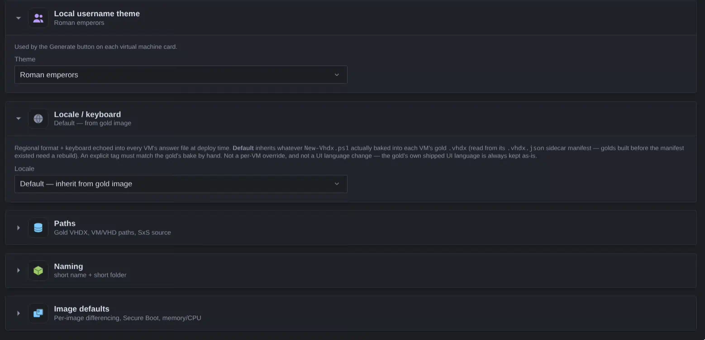

The password beside it is generated too: 32 characters, upper and lower case, a number and a
special, and no ambiguous glyphs — no `I`, `l`, `1`, `O` or `0` — because somebody will read it
off a console at some point.

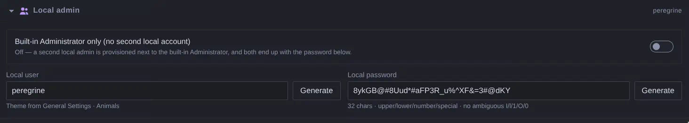

#### <picture><source media="(prefers-color-scheme: dark)" srcset=".github/assets/icons/language-dark.png"></picture> Locale / keyboard

Written into every VM's answer file at deploy time. Left on **Default**, each machine inherits
whatever its gold was baked with, read from the sidecar beside it. Set it explicitly only if it
matches the gold — this is a deploy-time echo, not a per-VM override, and it does not change
the UI language the image shipped with.

#### <picture><source media="(prefers-color-scheme: dark)" srcset=".github/assets/icons/storage-dark.png"></picture> Paths

Where things land on the host: the **VM path** (Hyper-V config folders), the **VHD path** (the
disks), the **gold VHDX directory** (blank means the `vhdx\` folder next to the scripts), and
the **SxS source** for .NET 3.5. All four sit behind a pencil — repointing where every machine
gets written should take a deliberate click, not a stray one.

Per VM, the build creates one folder under each root and names the disks after the machine:

<pre>
<picture><source media="(prefers-color-scheme: dark)" srcset=".github/assets/icons/storage-dark.svg"></picture> D:\vms\                          VM path — Hyper-V configuration
└─ <picture><source media="(prefers-color-scheme: dark)" srcset=".github/assets/icons/vm-dark.svg"></picture> dc-01\
<picture><source media="(prefers-color-scheme: dark)" srcset=".github/assets/icons/storage-dark.svg"></picture> D:\vhd\                          VHD path — the disks
└─ <picture><source media="(prefers-color-scheme: dark)" srcset=".github/assets/icons/files-dark.svg"></picture> dc-01\
   ├─ <picture><source media="(prefers-color-scheme: dark)" srcset=".github/assets/icons/disk-dark.svg"></picture> disk-dc01-c.vhdx           OS disk, child of the gold
   └─ <picture><source media="(prefers-color-scheme: dark)" srcset=".github/assets/icons/disk-dark.svg"></picture> disk-dc01-d.vhdx           data disk
</pre>

These are defaults, not decrees. Three things can outrank them, resolved per machine:

<picture>
  <source media="(prefers-color-scheme: dark)" srcset=".github/assets/paths-dark.png">
  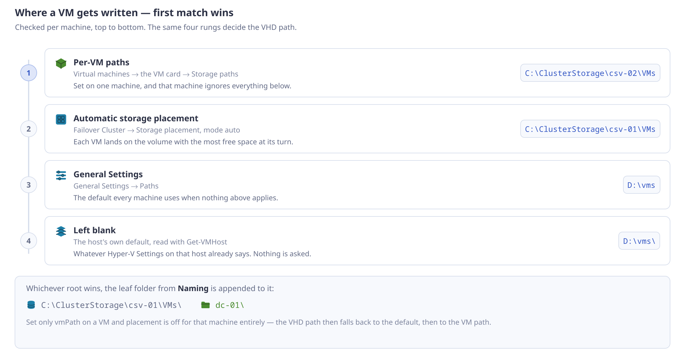
</picture>

The rung that catches people is the first one: a per-VM path takes that machine **out of
automatic storage placement altogether**. Pin one VM to a volume and it stays there while
everything else keeps spreading across your CSVs.

Leaving the paths blank is a good answer too — the build then uses whatever the host is
already configured to do. Two ways to see what that is:

<details>
<summary><b>Where the host's own defaults come from</b></summary>

**Hyper-V Manager** — *Hyper-V Settings → Virtual Hard Disks* and *Virtual Machines* are the
two folders every VM falls back to.

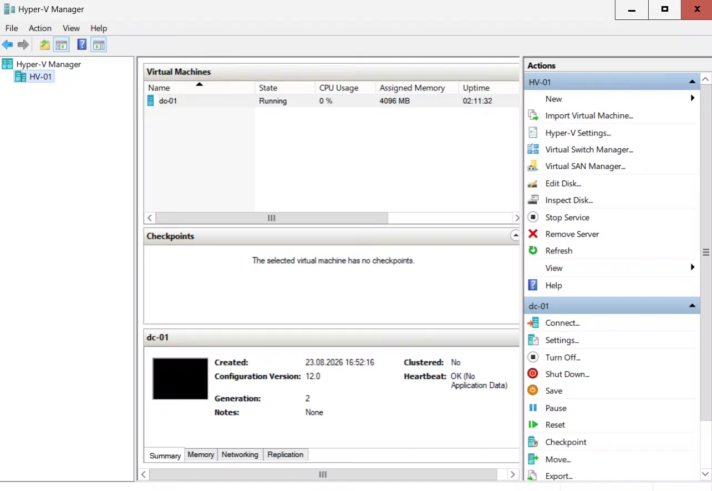

**PowerShell** — the same two values, and exactly what `Build-Vms.ps1` reads:

```powershell
Get-VMHost | Format-List VirtualMachinePath, VirtualHardDiskPath
```

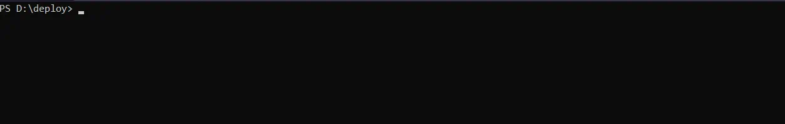

</details>

#### <picture><source media="(prefers-color-scheme: dark)" srcset=".github/assets/icons/vm-dark.svg"></picture> Naming

Two toggles that decide whether the Hyper-V object and its folders carry the domain FQDN:

| Toggle | Default | Effect |
|--------|---------|--------|
| VM name includes the FQDN | off | The Hyper-V name becomes `dc-01.ad.lab.tld` |
| Folder names include the FQDN | off | The leaf folder becomes `dc-01.ad.lab.tld\` |

<pre>
<picture><source media="(prefers-color-scheme: dark)" srcset=".github/assets/icons/hyperv-dark.png"></picture> Hyper-V Manager
└─ <picture><source media="(prefers-color-scheme: dark)" srcset=".github/assets/icons/vm-dark.svg"></picture> dc-01.ad.lab.tld               VM name, with the first toggle on
<picture><source media="(prefers-color-scheme: dark)" srcset=".github/assets/icons/storage-dark.svg"></picture> D:\vms\
└─ <picture><source media="(prefers-color-scheme: dark)" srcset=".github/assets/icons/files-dark.svg"></picture> dc-01.ad.lab.tld\             folder, with the second toggle on
<picture><source media="(prefers-color-scheme: dark)" srcset=".github/assets/icons/identity-dark.svg"></picture> Inside the guest the ComputerName stays dc-01 either way.
</pre>

Both toggles only apply to VMs with a resolvable domain join — everything else keeps its short
name everywhere, and the guest's own NetBIOS name is never affected.

#### <picture><source media="(prefers-color-scheme: dark)" srcset=".github/assets/icons/vlan-dark.svg"></picture> Available vSwitches

The switch names the Networks blade offers. They must match Hyper-V exactly — the studio takes
the string on faith, and preflight fails on a name no switch answers to.

<details>
<summary><b>Where the vSwitch names come from</b></summary>

**Hyper-V Manager** — *Actions → Virtual Switch Manager*. The **Name** box is the exact string
to type into the studio.

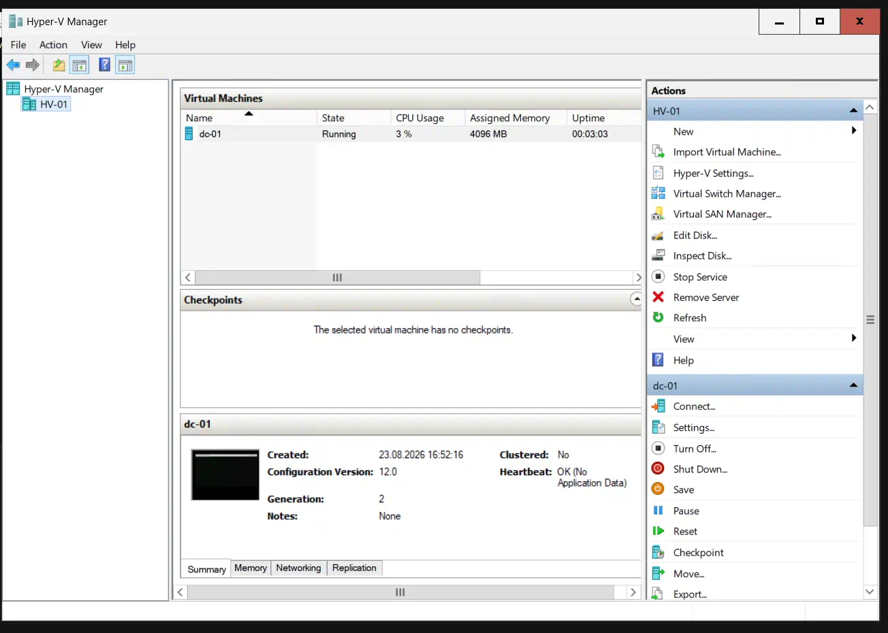

**PowerShell** — faster, and it prints the type and physical adapter beside each name:

```powershell
Get-VMSwitch | Format-Table Name, SwitchType, NetAdapterInterfaceDescription
```

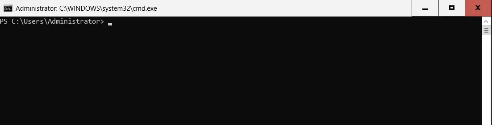

</details>

### <picture><source media="(prefers-color-scheme: dark)" srcset=".github/assets/blades/networks-dark.png"></picture> Networks

A subnet defined once: <picture><source media="(prefers-color-scheme: dark)" srcset=".github/assets/icons/vnet-dark.svg"></picture> vSwitch, VLAN, network ID, gateway, DNS. Bind a VM to it
and its IP is checked against that subnet, not against "looks like an IP".

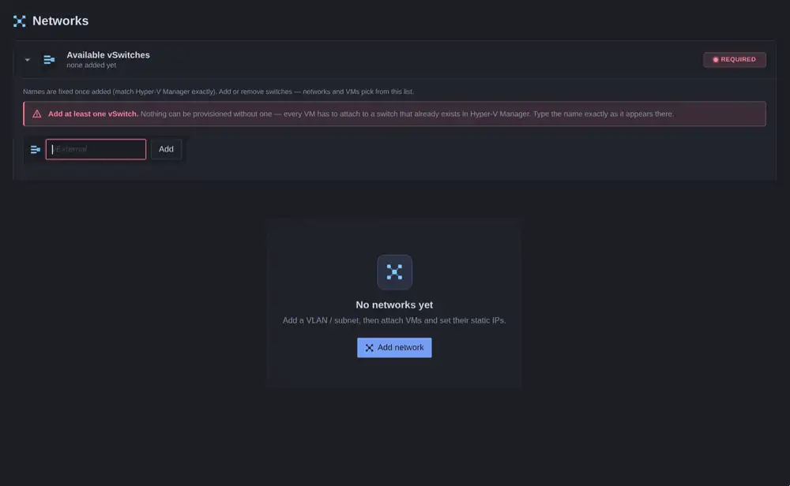

### <picture><source media="(prefers-color-scheme: dark)" srcset=".github/assets/blades/servers-dark.png"></picture> Virtual machines

One card per <picture><source media="(prefers-color-scheme: dark)" srcset=".github/assets/icons/vm-dark.svg"></picture> VM, top to bottom in the order you decide things. Cards collapse to a
summary line, so twelve machines still fit on a screen.

<pre>
<picture><source media="(prefers-color-scheme: dark)" srcset=".github/assets/icons/vm-dark.svg"></picture> VM card
├─ <picture><source media="(prefers-color-scheme: dark)" srcset=".github/assets/icons/shared-gallery-dark.svg"></picture> Template                       a whole VM already worked out
├─ <picture><source media="(prefers-color-scheme: dark)" srcset=".github/assets/icons/identity-dark.svg"></picture> Identity                       computer name + image
├─ <picture><source media="(prefers-color-scheme: dark)" srcset=".github/assets/icons/users-dark.svg"></picture> Local admin                    account, or Generate both
├─ <picture><source media="(prefers-color-scheme: dark)" srcset=".github/assets/icons/cpu-dark.svg"></picture> CPU / RAM
│  └─ <picture><source media="(prefers-color-scheme: dark)" srcset=".github/assets/icons/nested-virt-dark.svg"></picture> Additional processor options
├─ <picture><source media="(prefers-color-scheme: dark)" srcset=".github/assets/icons/vnet-dark.svg"></picture> Network                        adapters, networks, VLANs
├─ <picture><source media="(prefers-color-scheme: dark)" srcset=".github/assets/icons/disk-dark.svg"></picture> Disks                          data disks, formatted at first boot
├─ <picture><source media="(prefers-color-scheme: dark)" srcset=".github/assets/icons/extensions-dark.svg"></picture> Roles &amp; Features   <i>(Server)</i>   what the Add Roles wizard would install
├─ <picture><source media="(prefers-color-scheme: dark)" srcset=".github/assets/icons/client-apps-dark.svg"></picture> Built-in apps    <i>(client)</i>   strip the provisioned Store apps
├─ <picture><source media="(prefers-color-scheme: dark)" srcset=".github/assets/icons/storage-dark.svg"></picture> Storage paths                  per-VM overrides
├─ <picture><source media="(prefers-color-scheme: dark)" srcset=".github/assets/icons/secure-boot-dark.svg"></picture> Boot / disk                    Secure Boot, vTPM, differencing
├─ <picture><source media="(prefers-color-scheme: dark)" srcset=".github/assets/icons/start-action-dark.svg"></picture> Automatic start action
└─ <picture><source media="(prefers-color-scheme: dark)" srcset=".github/assets/icons/integration-dark.svg"></picture> Integration Services
</pre>

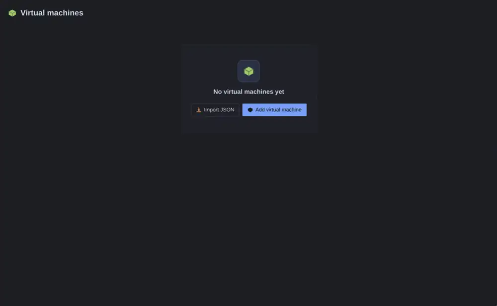

- <picture><source media="(prefers-color-scheme: dark)" srcset=".github/assets/icons/shared-gallery-dark.svg"></picture> **Template** — pick *Domain Controller* and the card fills itself in: edition, sizing, roles. Filter by release and edition; everything stays editable afterwards, and *no template* leaves the card as you built it.

  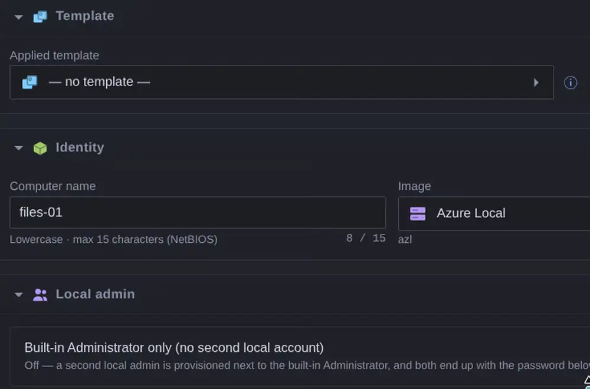
- <picture><source media="(prefers-color-scheme: dark)" srcset=".github/assets/icons/identity-dark.svg"></picture> **Identity** — names the machine, with NetBIOS rules enforced while you type and duplicates flagged on the spot, and picks its image.

  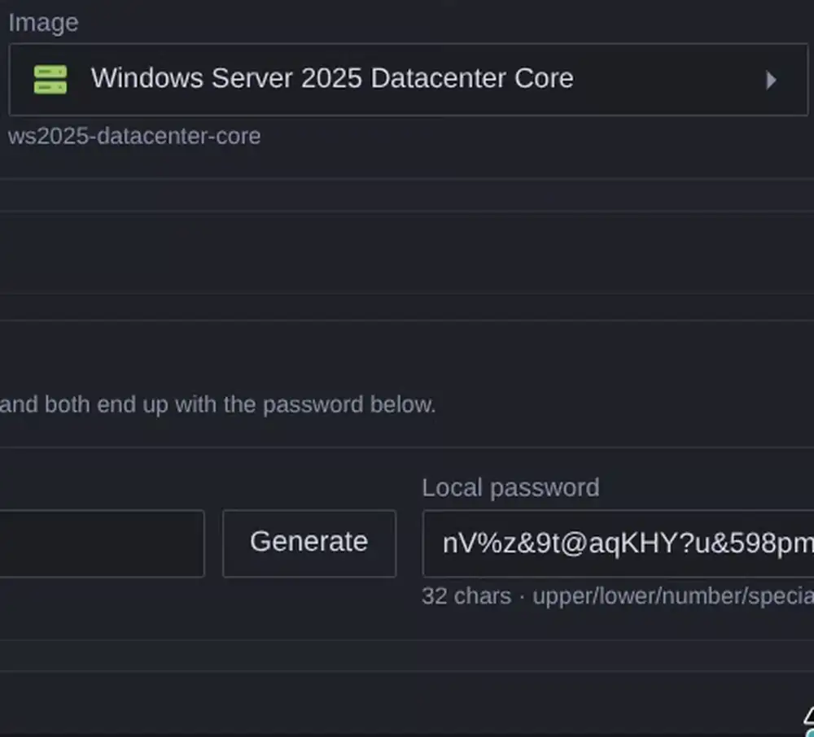

  > <picture><source media="(prefers-color-scheme: dark)" srcset=".github/assets/icons/help-dark.png"></picture> The picker lists what *can* be built, not what *is* built — the gold itself
  > has to exist, made with `New-Vhdx.ps1` up front. Preflight catches a missing one before
  > anything is created.
- <picture><source media="(prefers-color-scheme: dark)" srcset=".github/assets/icons/users-dark.svg"></picture> **Local admin** — takes a name and password, typed or generated. Client images can run as the built-in Administrator only.
- <picture><source media="(prefers-color-scheme: dark)" srcset=".github/assets/icons/cpu-dark.svg"></picture> **CPU / RAM** — sets memory and vCPUs; nested virtualization and processor compatibility hide under *Additional processor options*.
- <picture><source media="(prefers-color-scheme: dark)" srcset=".github/assets/icons/vnet-dark.svg"></picture> **Network** — binds the primary adapter to a network and adds more if you want them. Device naming is on, so the guest sees the adapter names you typed.
- <picture><source media="(prefers-color-scheme: dark)" srcset=".github/assets/icons/disk-dark.svg"></picture> **Disks** — the OS disk sits fixed at C:, its size and format decided when the gold was built. *Create and attach* adds data disks at D:, E:, … in order; each gets a size, Fixed or Dynamic, a filesystem and a volume label. At first boot the guest initializes the disk GPT, partitions it, formats it and mounts it on its letter with that label — *Leave raw* skips all of that and hands you a blank offline disk. File names follow the VM name (`disk-<server>-d.vhdx`) until the pencil pins one by hand. ReFS needs an Enterprise-class client image or a Server.

  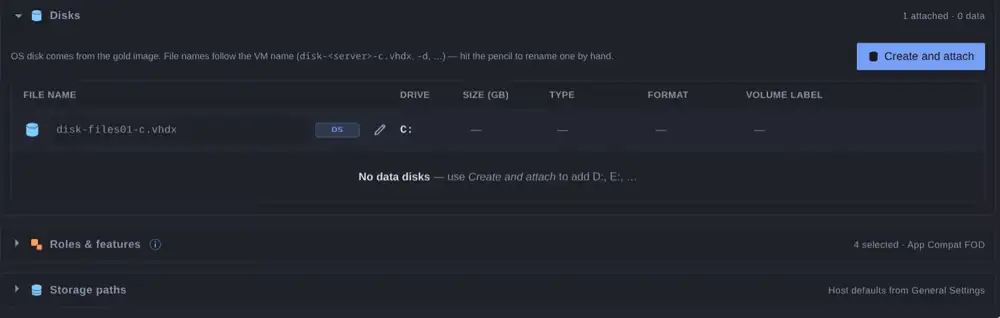
- <picture><source media="(prefers-color-scheme: dark)" srcset=".github/assets/icons/extensions-dark.svg"></picture> **Roles &amp; Features** *(Server)* — tick a role, get what the Add Roles wizard would install: role services nested, management tools alongside, sixteen roles from AD DS to WSUS. Windows features (Failover Clustering, MPIO, .NET 3.5…) sit beside them.
- <picture><source media="(prefers-color-scheme: dark)" srcset=".github/assets/icons/client-apps-dark.svg"></picture> **Built-in apps** *(client)* — strips the provisioned Store apps offline, before first boot.
- <picture><source media="(prefers-color-scheme: dark)" srcset=".github/assets/icons/secure-boot-dark.svg"></picture> **Boot / disk** — toggles Secure Boot and vTPM, and chooses a differencing disk versus a full copy of the gold.

  > <picture><source media="(prefers-color-scheme: dark)" srcset=".github/assets/icons/security-dark.png"></picture> **Differencing disks depend on the gold.** Every child references it by
  > path — move, rename or rebuild the gold and the VM stops booting. Pick a full copy for
  > anything that should outlive the golds folder.
- <picture><source media="(prefers-color-scheme: dark)" srcset=".github/assets/icons/start-action-dark.svg"></picture> **Automatic start action** — decides what the VM does when the host reboots.
- <picture><source media="(prefers-color-scheme: dark)" srcset=".github/assets/icons/integration-dark.svg"></picture> **Integration Services** — turns the six guest services on or off per VM.

### <picture><source media="(prefers-color-scheme: dark)" srcset=".github/assets/blades/vhdsets-dark.png"></picture> VHD Sets

Shared `.vhds` disks for guest clusters — the same <picture><source media="(prefers-color-scheme: dark)" srcset=".github/assets/icons/disk-pool-dark.svg"></picture> disk attached to two or
more VMs. Name it, size it, tick the machines; the name follows the members until you pin it.

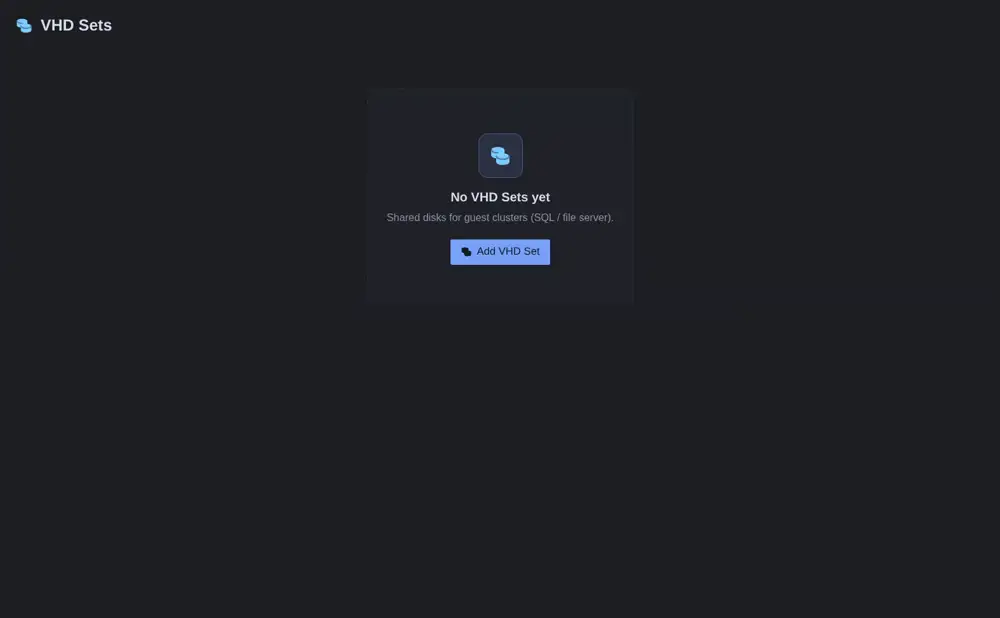

Each card is one shared disk:

- **File name** — generated from the attached members, `vhds-files01-files02-01.vhds` style,
  and it keeps re-deriving itself as you attach or rename VMs. Pin a custom name with the
  pencil and it stops following.
- **Size (GB)** and **Type** — Fixed or Dynamic, like any data disk.
- **Custom path (CSV / SMB 3)** — where the `.vhds` file lands. Leave it blank and the set is
  written to `{vhdPath}\vhds\` under the host default. Either way the location has to be a
  Cluster Shared Volume or an SMB 3 share.
- **Attach to guest cluster nodes** — the same VM picker as everywhere else. Every attached
  VM gets the disk as a shared `.vhds`; a set with no VMs attached is simply not built.

> <picture><source media="(prefers-color-scheme: dark)" srcset=".github/assets/icons/help-dark.svg"></picture> A shared disk needs a home every node can reach: a Cluster Shared Volume or an
> SMB 3 share. Preflight refuses anything else the moment the disk is actually shared —
> the other nodes cannot reach a path that exists on one host only.

### <picture><source media="(prefers-color-scheme: dark)" srcset=".github/assets/blades/cluster-dark.png"></picture> Failover Cluster

For when the host itself is a cluster member. Name the cluster, list your CSVs, tick the VMs
that become clustered roles — each lands on whichever volume has the most room, and
`Build-Vms.ps1` runs `Add-ClusterVirtualMachineRole` once the VM exists.

### <picture><source media="(prefers-color-scheme: dark)" srcset=".github/assets/blades/domainjoin-dark.png"></picture> Domain Join

<picture><source media="(prefers-color-scheme: dark)" srcset=".github/assets/icons/identity-dark.svg"></picture> Join accounts defined once, attached to VMs — one per tier or OU if you like,
with a target OU per machine. The join runs during Windows specialize, before anyone logs in.

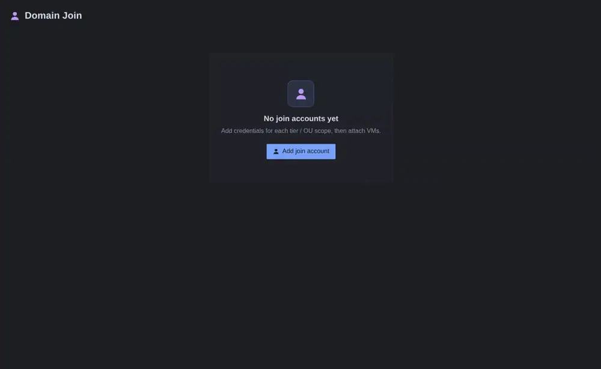

Each card is one join account: the **domain** to join, the **join user** allowed to create
computer objects (UPN form works well), and its **password**. All three are required — the
preflight blocks a build on an incomplete account. Add more cards when different machines
need different credentials; a VM can belong to only one account.

Attaching works two ways:

- **Use for every virtual machine** — one switch and the whole config joins with this
  account, including VMs you create later. It only appears when exactly one account exists;
  hand-picked assignments are kept and come back when you turn it off.
- **Choose virtual machines…** — a filterable picker per account, for mixed labs where only
  some machines join.

Every attached VM gets an **OU path** field — the distinguished name where its computer
object lands, e.g. `OU=Servers,OU=Tier0,DC=ad,DC=example,DC=invalid`. Leave it empty and the
machine goes to the domain's default container, `CN=Computers`.

> <picture><source media="(prefers-color-scheme: dark)" srcset=".github/assets/icons/help-dark.svg"></picture> A domain-joined VM needs a static IP here — the join runs during specialize, so
> the address has to exist before any DHCP lease would. DHCP elsewhere on the network is fine;
> this VM just doesn't use it.

### <picture><source media="(prefers-color-scheme: dark)" srcset=".github/assets/blades/azurearc-dark.png"></picture> Azure Arc

An Arc landing zone: subscription, tenant, resource group, region, and the service principal
allowed to onboard into it. Attach VMs; each pulls the Connected Machine agent at first boot
and registers itself.

Two auth modes:

| Mode | The secret | Host needs |
|------|------------|------------|
| <picture><source media="(prefers-color-scheme: dark)" srcset=".github/assets/icons/key-dark.svg"></picture> **Service principal** | Rides inside the guest briefly, deleted after the connect attempt | Nothing |
| <picture><source media="(prefers-color-scheme: dark)" srcset=".github/assets/icons/hyperv-dark.svg"></picture> **Host context** | Never enters the guest — the host onboards each VM over PowerShell Direct | `Az.ConnectedMachine` + a signed-in Az session |

Keep the secret out of `config.json` entirely with `-ArcServicePrincipalPath`.

For **host context**, check the host before building:

```powershell
Install-Module Az.ConnectedMachine -Scope AllUsers      # once
Get-AzContext | Format-List Account, Subscription, Tenant

# no context, or the wrong one?
Connect-AzAccount -Subscription "<subscription-id>"              # host with Desktop Experience
Connect-AzAccount -Subscription "<subscription-id>" -DeviceCode  # Core / no browser
```

> <picture><source media="(prefers-color-scheme: dark)" srcset=".github/assets/icons/help-dark.svg"></picture> `-DeviceCode` signs in from another device — Conditional Access must allow the
> device code flow for that account, or the sign-in is blocked before you ever see a prompt.

<details>
<summary><b>One-time Azure setup (app registration, role, resource providers)</b></summary>

```bash
az group create --name rg-arc-servers --location westeurope

az ad sp create-for-rbac --name "arc-vm-onboarding" --skip-assignment --years 1
# note appId, password, tenant

az role assignment create \
  --assignee <appId> \
  --role "Azure Connected Machine Onboarding" \
  --scope "/subscriptions/<subscriptionId>/resourceGroups/rg-arc-servers"

# Once per subscription — skipping this is the #1 cause of "azcmagent connect failed (exit 42)"
az provider register --namespace Microsoft.HybridCompute
az provider register --namespace Microsoft.GuestConfiguration
az provider register --namespace Microsoft.HybridConnectivity
az provider register --namespace Microsoft.Compute
```

</details>

### <picture><source media="(prefers-color-scheme: dark)" srcset=".github/assets/blades/review-dark.png"></picture> Review and validate

Everything you configured, summarized, plus every offline consistency check — duplicate names,
IPs outside their subnet, missing passwords, missing golds. Fix it here, not on the host.

### <picture><source media="(prefers-color-scheme: dark)" srcset=".github/assets/blades/passwords-dark.png"></picture> Passwords

Every generated local account password in one place — reveal, copy, regenerate.

> <picture><source media="(prefers-color-scheme: dark)" srcset=".github/assets/icons/security-dark.svg"></picture> They're written into `config.json` in plain text. Keep the file with the
> rest of the lab and delete it once `Build-Vms.ps1` has run.

### <picture><source media="(prefers-color-scheme: dark)" srcset=".github/assets/blades/export-dark.png"></picture> Export

Download <picture><source media="(prefers-color-scheme: dark)" srcset=".github/assets/icons/answer-file-dark.svg"></picture> `config.json` and drop it next to `Build-Vms.ps1`.

## <picture><source media="(prefers-color-scheme: dark)" srcset=".github/assets/icons/powershell-dark.png"></picture> Build the VMs — `Build-Vms.ps1`

```powershell
.\Build-Vms.ps1
```

Run it next to `config.json`. The menu offers **Build all VMs**, **Build selected** — a
multi-select over the machines in the config — and **Check**, which runs the full preflight
without touching the host. Every build runs the same preflight anyway before creating anything.

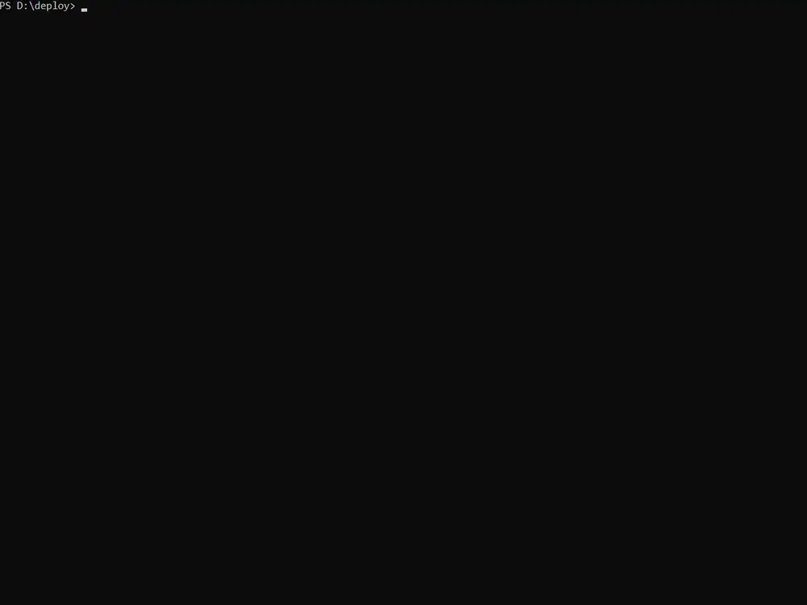

### <picture><source media="(prefers-color-scheme: dark)" srcset=".github/assets/icons/validate-dark.png"></picture> Preflight

Check verifies offline what would otherwise fail halfway through a build: every <picture><source media="(prefers-color-scheme: dark)" srcset=".github/assets/icons/vm-dark.svg"></picture> VM
resolves a gold, its generated answer file actually parses, its vSwitch exists on the host, its
password is present, names and IPs are unique and inside their subnets, and every shared
<picture><source media="(prefers-color-scheme: dark)" srcset=".github/assets/icons/disk-pool-dark.svg"></picture> VHD Set sits on storage that supports sharing. Errors block the build;
warnings don't.

Two questions may come up before it runs:

- <picture><source media="(prefers-color-scheme: dark)" srcset=".github/assets/icons/language-dark.svg"></picture> **Gold language** — if a gold exists in more than one language, one card
  settles it for the whole run: build everything with one language, or pick per VM with the
  arrow keys. VMs whose image exists in only one language are shown locked, and the card says
  which machines an "every VM" choice does not reach.
- <picture><source media="(prefers-color-scheme: dark)" srcset=".github/assets/icons/fod-dark.png"></picture> **Features on Demand** — see below.

<!-- SCREENSHOT: gold language card -->

### <picture><source media="(prefers-color-scheme: dark)" srcset=".github/assets/icons/fod-dark.png"></picture> Features on Demand — RSAT and the App Compatibility pack

Two things a VM card can ask for don't live in the install image: **RSAT** on Windows 11
(the AD, DNS, DHCP and friends management tools) and the **Server Core App Compatibility
pack** (mmc, Event Viewer, perfmon and other GUI leftovers on a Core server). Windows ships
them separately, as Features on Demand.

If any selected VM wants one, `Build-Vms.ps1` asks once per run — one card for the Server
FOD per release, one for all Windows 11 RSAT — with three answers:

- **Select FoD ISO** — browse to the *Languages and Optional Features* ISO matching that
  Windows release. The build mounts it and installs everything offline, straight into the
  VHD, before the VM ever boots.
- **Install in guest** — each VM pulls the payload from Windows Update at first boot.
- **Skip** — the VMs build without them.

Give it the ISO. The online path adds minutes to every first boot and needs internet — or a
WSUS that allows optional content, without which every download fails. RSAT is the worst
case: each capability is a separate Windows Update download, per VM. The offline install is
one mount and a few seconds each.

> <picture><source media="(prefers-color-scheme: dark)" srcset=".github/assets/icons/help-dark.svg"></picture> A Windows 11 VM with RSAT baked in from the ISO takes noticeably longer at the
> **first** login — Windows is finishing the staged capabilities. One-time cost; every login
> after that is normal.

### <picture><source media="(prefers-color-scheme: dark)" srcset=".github/assets/icons/hyperv-dark.png"></picture> What a build does, per VM

The OS disk comes first — a differencing disk off the gold by default, or a full copy if the
card says so. Then the VM itself: adapters renamed to what you typed (device naming on, VLANs
applied), data disks created empty, VHD Sets attached, the automatic start action set. The
per-VM `unattend.xml` goes into the disk along with a first-boot payload, the VM joins the
host cluster if you marked it, and it starts — unless you said not to.

At first boot the guest takes over: it formats and mounts its data disks, renames its adapters
from the inside, installs any online Features on Demand, joins the domain during specialize,
and onboards to <picture><source media="(prefers-color-scheme: dark)" srcset=".github/assets/icons/azure-dark.png"></picture> Azure Arc. You watch it happen from the outside — there is
nothing to click.

> <picture><source media="(prefers-color-scheme: dark)" srcset=".github/assets/icons/security-dark.png"></picture> **Differencing disks depend on the gold.** Every child references it by
> path — move, rename or rebuild the gold and every VM built from it stops booting. A full
> copy has no such string attached.

Two details worth knowing. Windows redacts the passwords inside the answer file once Setup has
used them. And with host-context Arc, the host waits for PowerShell Direct after each start
and onboards the VM itself, so the secret never enters the guest.

<details>
<summary><b>Example run log</b> — two of four VMs, a Win11 client and a Server Core DC</summary>

```text
2026-08-30 14:52:42 [ info  ] Server 'avd-01' -> gold 'D:\deploy\vhdx\hv-dede-w11-enterprise-ms.vhdx' (imageId=w11-enterprise-ms)
2026-08-30 14:52:42 [ run   ] Copying gold image to 'D:\vhd\avd-01\disk-avd01-c.vhdx'
2026-08-30 14:52:42 [ run   ] Creating Gen2 VM 'avd-01' (8 GB / 4 CPU)
2026-08-30 14:52:43 [ run   ] VLAN 10 set on 'avd-01'
2026-08-30 14:52:43 [ run   ] Automatic start action 'StartIfRunning' (0s delay) on 'avd-01'
2026-08-30 14:52:43 [ run   ] Enabled vTPM on 'avd-01'
2026-08-30 14:52:43 [ run   ] Applied Integration Services on 'avd-01' (Time Synchronization=False)
2026-08-30 14:52:43 [ info  ] Adapter 'vnic-01' MAC = 00-15-5D-69-F6-8C
2026-08-30 14:52:43 [ run   ] Injecting unattend into 'D:\vhd\avd-01\disk-avd01-c.vhdx'
2026-08-30 14:52:44 [ run   ] Clearing offline UnattendFile registry pointer
2026-08-30 14:52:44 [ run   ] Removing leftover 'F:\Windows\Panther\UnattendGC'
2026-08-30 14:52:44 [ info  ] Wrote 'F:\Windows\Panther\unattend.xml' (5132 bytes)
2026-08-30 14:52:44 [ run   ] Setting offline client OOBE registry bypasses
2026-08-30 14:52:44 [ o.k.  ] Injected GuestProvision payload + SetupComplete.cmd
2026-08-30 14:52:44 [ info  ] Client image - Win11 OOBE skips applied
2026-08-30 14:52:44 [ run   ] Starting VM 'avd-01'
2026-08-30 14:52:45 [ o.k.  ] Provisioned 'avd-01' successfully
2026-08-30 14:52:47 [ info  ] Server 'dc-01' -> gold 'D:\deploy\vhdx\hv-enus-ws2025-datacenter-core.vhdx' (imageId=ws2025-datacenter-core)
2026-08-30 14:52:47 [ run   ] Copying gold image to 'D:\vhd\dc-01\disk-dc01-c.vhdx'
2026-08-30 14:52:47 [ run   ] Creating Gen2 VM 'dc-01' (4 GB / 2 CPU)
2026-08-30 14:52:48 [ run   ] VLAN 10 set on 'dc-01'
2026-08-30 14:52:48 [ run   ] Automatic start action 'StartIfRunning' (0s delay) on 'dc-01'
2026-08-30 14:52:48 [ run   ] Applied Integration Services on 'dc-01' (Time Synchronization=False)
2026-08-30 14:52:48 [ info  ] Adapter 'vnic-01' MAC = 00-15-5D-1E-62-18
2026-08-30 14:52:48 [ run   ] Injecting unattend into 'D:\vhd\dc-01\disk-dc01-c.vhdx'
2026-08-30 14:52:48 [ run   ] Clearing offline UnattendFile registry pointer
2026-08-30 14:52:49 [ run   ] Removing leftover 'F:\Windows\Panther\UnattendGC'
2026-08-30 14:52:49 [ info  ] Wrote 'F:\Windows\Panther\unattend.xml' (4411 bytes)
2026-08-30 14:52:49 [ run   ] Installing Server Core App Compatibility FOD offline from 'E:\LanguagesAndOptionalFeatures'
2026-08-30 14:53:22 [ o.k.  ] Server Core App Compatibility FOD OK (RestartNeeded=False)
2026-08-30 14:53:22 [ o.k.  ] Injected GuestProvision payload + SetupComplete.cmd
2026-08-30 14:53:22 [ run   ] Installing 3 Windows feature(s) offline into VHD
2026-08-30 14:54:18 [ o.k.  ] Offline feature 'AD-Domain-Services' OK
2026-08-30 14:54:44 [ o.k.  ] Offline feature 'RSAT-ADDS-Tools' OK
2026-08-30 14:54:46 [ o.k.  ] Offline feature 'RSAT-AD-PowerShell' OK
2026-08-30 14:55:01 [ run   ] Starting VM 'dc-01'
2026-08-30 14:55:01 [ o.k.  ] Provisioned 'dc-01' successfully
2026-08-30 14:55:07 [ o.k.  ] All selected servers provisioned successfully
2026-08-30 14:55:07 [ info  ] Runtime 00:02:41.73
```

</details>

### <picture><source media="(prefers-color-scheme: dark)" srcset=".github/assets/icons/storage-dark.png"></picture> Slow storage

**Slow host mode** reorders the run for spinning disks or a busy CSV: first every disk is
created, then every VM, then everything starts. Nothing competes with a 60 GB copy for IO.

<details>
<summary><b>Parameters, for scripted builds</b></summary>

The menu is the intended way in. For a build that has become routine:

```powershell
.\Build-Vms.ps1 -CheckOnly                          # validate, change nothing
.\Build-Vms.ps1 -BuildAll                           # everything in config.json
.\Build-Vms.ps1 -VmName 'dc-01','app-01' -SkipStart # some VMs, left off
.\Build-Vms.ps1 -BuildAll -GoldLanguage enus        # answer the language question up front
.\Build-Vms.ps1 -BuildAll -SlowHost                 # slow storage mode
.\Build-Vms.ps1 -BuildAll -ArcServicePrincipalPath .\arc-deploy.json
.\Build-Vms.ps1 -ConfigPath 'D:\Lab\config.json' -BuildAll
```

</details>

## <picture><source media="(prefers-color-scheme: dark)" srcset=".github/assets/icons/update-dark.png"></picture> Toolbox

A few scripts that grew out of testing this project — a host needed wiping, fixed disks had
eaten a volume, a finished lab had to go. They kept earning their place, so they ship with it.
Same menu style as `Build-Vms.ps1`.

> <picture><source media="(prefers-color-scheme: dark)" srcset=".github/assets/icons/security-dark.png"></picture> **Lab use only.** These move, shrink and delete real VMs. Never point them
> at a production host.

| Script | Does |
|--------|------|
| `toolbox\Migrate-Vms.ps1` | Export VMs (and vTPM certs, and optionally switches) to a disk or share before a host reinstall; import them back after. Check mode validates a package first. |
| `toolbox\Convert-Vhdx.ps1` | Convert Fixed disks to Dynamic and actually reclaim the space — guest ReTrim, zero fallback, host compact. |
| `toolbox\Remove-Vms.ps1` | Tear the lab down: cluster role, VM, disks, folders. **Permanent** — check the selection twice. |

## <picture><source media="(prefers-color-scheme: dark)" srcset=".github/assets/icons/files-dark.png"></picture> Reference

### <picture><source media="(prefers-color-scheme: dark)" srcset=".github/assets/icons/files-dark.png"></picture> Repository layout

<pre>
<picture><source media="(prefers-color-scheme: dark)" srcset=".github/assets/icons/files-dark.png"></picture> HyperV-VM-Studio
├─ <picture><source media="(prefers-color-scheme: dark)" srcset=".github/assets/icons/powershell-dark.png"></picture> New-Vhdx.ps1                gold image builder
├─ <picture><source media="(prefers-color-scheme: dark)" srcset=".github/assets/icons/powershell-dark.png"></picture> Build-Vms.ps1               provisioning engine
├─ <picture><source media="(prefers-color-scheme: dark)" srcset=".github/assets/icons/monitor-dark.png"></picture> html\hyperv-vm-studio.html    the studio
├─ <picture><source media="(prefers-color-scheme: dark)" srcset=".github/assets/icons/integration-dark.png"></picture> guest-files\                first-boot payloads injected per VM
├─ <picture><source media="(prefers-color-scheme: dark)" srcset=".github/assets/icons/update-dark.png"></picture> toolbox\                    migrate / convert / remove
├─ <picture><source media="(prefers-color-scheme: dark)" srcset=".github/assets/icons/iso-media-dark.png"></picture> isos\                       your ISOs
├─ <picture><source media="(prefers-color-scheme: dark)" srcset=".github/assets/icons/gold-image-dark.png"></picture> vhdx\                       built golds
└─ <picture><source media="(prefers-color-scheme: dark)" srcset=".github/assets/icons/monitor-dark.png"></picture> logs\                       one timestamped log per run
</pre>

### <picture><source media="(prefers-color-scheme: dark)" srcset=".github/assets/icons/monitor-dark.png"></picture> Logs

Host: `logs\<script>\yyyyMMdd-HHmm.log`, tagged `[ info ] [ o.k. ] [ warn ] [ error ]`.
Guest: `C:\ProgramData\VmDeployLogs\GuestProvision.log`, same format.

### <picture><source media="(prefers-color-scheme: dark)" srcset=".github/assets/icons/security-dark.png"></picture> Security

| Secret | Lives in | Do |
|--------|----------|-----|
| Local admin passwords | `config.json`, then the unattend (redacted by Setup after use) | Delete `config.json` after the build |
| Domain join password | same | Least-privilege join account, rotate after labs |
| Arc SP secret | `config.json` or a one-time file in the guest, deleted after connect | Prefer `-ArcServicePrincipalPath` or host-context mode |

### <picture><source media="(prefers-color-scheme: dark)" srcset=".github/assets/icons/help-dark.png"></picture> Troubleshooting

| Symptom | Fix |
|---------|-----|
| `Config not found` | Export from the studio, save next to `Build-Vms.ps1` |
| `No gold image for imageId=…` | Build that edition with `New-Vhdx.ps1`; check `vhdx\` |
| `More than one gold image for imageId=…` | Interactive: pick in the language card. Unattended: `-GoldLanguage` or set the studio locale |
| Preflight: switch missing | Create the vSwitch; the name in Networks must match exactly |
| Name too long | 15 NetBIOS characters, lowercase |
| `…does not support virtual hard disk sharing` | Put the `.vhds` on CSV or SMB 3 |
| Anything else | The log names the step that failed — host log first, then the guest log |

```powershell
Get-ChildItem .\vhdx -Filter 'hv-*.vhdx' | Select-Object Name, Length, LastWriteTime
Get-VMSwitch | Format-Table Name, SwitchType
```
