<div align="center">

<picture>
  <source media="(prefers-color-scheme: dark)" srcset=".github/assets/wordmark-dark.png">
  
</picture>

<p><b>Design Hyper-V VMs in the browser. Deploy them with PowerShell.</b></p>

<p>


</p>

</div>

## <picture><source media="(prefers-color-scheme: dark)" srcset=".github/assets/icons/vm-dark.png"></picture> Quick start

Elevated PowerShell on a Hyper-V host, a Windows ISO in the `media\` folder (a Linux gold needs
no ISO — the script downloads the distribution's cloud image itself):

```powershell
.\New-Vhdx.ps1                                # build a gold image — Windows from an ISO, or a Linux distribution
Start-Process .\html\hyperv-vm-studio.html    # design the lab, then Download config.json
.\Build-Vms.ps1                               # menu → Build all VMs
```

A few minutes later the VMs are running and sitting at a login prompt. Passwords are on the
studio's **Passwords** page.

<!-- VIDEO: full run, ISO to login prompt -->

## <picture><source media="(prefers-color-scheme: dark)" srcset=".github/assets/icons/hyperv-dark.png"></picture> What you get

Labs rot. You stand a domain controller up by hand, poke at it for six months, and then the
host needs a reinstall and the whole thing is gone. This repo makes the lab a file: design it
once, rebuild it whenever, throw it away without flinching.

<picture><source media="(prefers-color-scheme: dark)" srcset=".github/assets/pipeline-dark.png">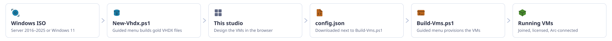</picture>

Three parts, used in that order:

| | |
|---|---|
| <picture><source media="(prefers-color-scheme: dark)" srcset=".github/assets/icons/gold-image-dark.png"></picture> **`New-Vhdx.ps1`** | Turns a Windows ISO into a generalized Gen2 gold image. Server 2016–2025, Windows 11 — including Enterprise multi-session and Server 2025 Datacenter: Azure Edition. Or a Linux cloud image into one: Ubuntu, Debian, Fedora, Rocky Linux, AlmaLinux, Oracle Linux, openSUSE Leap, Arch. |
| <picture><source media="(prefers-color-scheme: dark)" srcset=".github/assets/icons/monitor-dark.png"></picture> **The studio** | A single HTML file. Click the lab together — machines, disks, networks, domain join, Windows roles — and download `config.json`. |
| <picture><source media="(prefers-color-scheme: dark)" srcset=".github/assets/icons/powershell-dark.png"></picture> **`Build-Vms.ps1`** | Reads that file on the host. Differencing disks, answer files — or a cloud-init seed for Linux — VMs created and started. |

What that covers, beyond the obvious:

- **Domain join and Azure Arc onboarding** happen on their own at first boot. You never log in to set them up.
- **Linux VMs** sit in the same lab as the Windows ones — same studio, same config, same build. They join the domain through realmd and sssd and onboard to Arc through cloud-init, just as hands-off.
- **Azure Local golds** — pick Azure Local as the target and the image applies its locale and time zone at first boot, where Arc provisioning cannot overwrite them. AVD session host golds get built locally instead of exported from Azure.
- **Guest clusters** — VHD Sets shared between guests and cluster placement on the host, all checked in preflight before anything is created.
- **A toolbox** for the rest of a lab's life — it migrates VMs off a host before a reinstall, thins out fixed disks, and tears everything down again.

Every run starts at an ISO and ends at a working lab. Nothing assumes a machine that already
exists — which is the point, if you wipe your host on purpose.

## <picture><source media="(prefers-color-scheme: dark)" srcset=".github/assets/icons/validate-dark.png"></picture> Before you start

Run everything on the Hyper-V host itself, in an elevated PowerShell (5.1 or 7 both work).

| You need | Notes |
|----------|-------|
| Windows with the Hyper-V role | Server or client, Gen2 VMs |
| A Windows ISO | Server 2016–2025 or Windows 11. Evaluation Center, Visual Studio subscription — any plain install media. Not needed for Linux |
| Internet access | For Linux golds: the cloud image is downloaded, and the gold boots once to install packages from the distribution's mirrors |
| Disk space | Tens of GB per gold; differencing keeps the per-VM cost small |
| A vSwitch | Create it in Hyper-V Manager first; the studio references it by name |
| Azure subscription | Only for Azure Arc onboarding — optional |

Put the ISO in the `media\` folder next to the scripts. On the host itself, not a share —
the script mounts it, and mounting over the network goes badly.

## <picture><source media="(prefers-color-scheme: dark)" srcset=".github/assets/icons/gold-image-dark.png"></picture> Build gold images — `New-Vhdx.ps1`

```powershell
.\New-Vhdx.ps1
```

The menu walks you through everything — that is the intended way to use it. One run can build
several editions; each becomes its own VHDX.


What the menus ask, in order:

**ISO** — the picker lists whatever is in `media\`. You can also browse to a path, or point it
at a drive that is already mounted.

**Target platform** — where the gold will be deployed:

| Target | You get |
|--------|---------|
| **Hyper-V** | `hv-*.vhdx` — the input for `Build-Vms.ps1` |
| **Azure Local** | `golds\azl\azl-*.vhdx` — upload as an Azure Local VM image; locale and time zone are applied at the VM's first boot so Arc provisioning can't overwrite them. Its trimmed sidecar carries what the upload needs, including `azureImageName`, a ready `--name` |

**Editions** — a multi-select over every index the ISO carries. Build the ones you will
actually deploy.

**Virtual editions** — some SKUs never ship on ISO media and are reached by an offline
edition change after generalize instead. When the ISO carries a matching base index, the
edition list grows a virtual-edition row for it. Each tick is its own build — tick both
the base row and its virtual-edition row and one run produces both golds from the same index.

- **Enterprise multi-session** — offered on a Windows 11 Pro index.
- **Datacenter: Azure Edition** — offered on a Windows Server 2025 Datacenter index (Core
  and Desktop Experience each get their own row). Server 2025 only — older media has no
  conversion path to this SKU.

> <picture><source media="(prefers-color-scheme: dark)" srcset=".github/assets/icons/help-dark.png"></picture> Multi-session is only buildable from Pro. Licensed for AVD — activates on Azure Local, not on plain Hyper-V.

> <picture><source media="(prefers-color-scheme: dark)" srcset=".github/assets/icons/help-dark.png"></picture> Azure Edition is supported on Azure and Azure Local only — there Azure verification activates it and hotpatch is on by default, at no cost. On plain Hyper-V the VM deactivates itself once it notices where it runs.

**Locale, keyboard, time zone** — baked into the image. The locale list comes from
`data\locales.json` (generated by `toolbox\New-LocaleCatalog.ps1` on a Windows host —
every Windows locale except the IME ones, with its own `default` named at the top);
without the file the script falls back to its hand-verified fourteen.
The UI language stays whatever the ISO shipped.

**Features** — a handful of ticks, applied offline into the image:

| Feature | Default | Applies to |
|---------|---------|------------|
| Remote Desktop + firewall rules | on | all |
| ICMP echo (ping) | on | all |
| Prevent automatic BitLocker device encryption | on | client |
| VM power plan — High performance, display and sleep never, no hibernation | on | client |
| Block per-user input methods on the sign-in screen | off | all |
| Microsoft Edge Config | off | client + Server Desktop Experience |
| Suppress Server Manager at logon | off | server |
| Suppress Welcome Experience / first sign-in animation | off | client |

> <picture><source media="(prefers-color-scheme: dark)" srcset=".github/assets/icons/help-dark.png"></picture> Windows 11 encrypts itself after OOBE on a VM with vTPM and Secure Boot. If you arm
> BitLocker by policy after deployment, leave the prevent-tick on so the image doesn't
> pre-empt it. Untick it if you want the Windows default.

> <picture><source media="(prefers-color-scheme: dark)" srcset=".github/assets/icons/help-dark.png"></picture> The power plan is the settings a VM would otherwise inherit from a laptop: console
> blanked after ten minutes, asleep after thirty, and a `hiberfil.sys` charged to every
> differencing disk cloned off the gold. High performance rather than Ultimate Performance —
> Ultimate is hidden on client and only exists once `powercfg -duplicatescheme` mints it
> under a fresh GUID, for idle tunables the hypervisor mostly owns anyway. It is baked as
> machine policy (`SOFTWARE\Policies\Microsoft\Power`), the same knobs an Administrative
> Templates GPO sets — the scheme's own registry tree is ACL'd against Administrators even
> offline, and a later domain GPO overrides the baked policy on its own. The deployed VM's
> power page says the settings are managed by your organization, because they are.

> <picture><source media="(prefers-color-scheme: dark)" srcset=".github/assets/icons/help-dark.png"></picture> **Microsoft Edge Config** writes a machine policy baseline under
> `SOFTWARE\Policies\Microsoft\Edge` — the same values the Edge ADMX sets, so the browser
> treats them as managed and a domain GPO still overrides them later:
>
> | Policy | Value |
> |--------|-------|
> | `ManagedSearchEngines` | Google only, `is_default` |
> | `DefaultSearchProviderEnabled` / `Name` / `SearchURL` / `SuggestURL` | Google — required for the new tab box to honour it |
> | `NewTabPageSearchBox` | `redirect` (the box searches through the address bar) |
> | `QuickSearchShowMiniMenu` | `0` — no mini menu on text selection |
> | `HideFirstRunExperience` | `1` |
> | `NewTabPageContentEnabled` | `0` — no Microsoft content |
> | `NewTabPageAllowedBackgroundTypes` | `3` — no background images |
> | `NewTabPageHideDefaultTopSites` | `1` |
> | `DiagnosticData` | `1` — required data only |
>
> Offered wherever a browser exists — every client image and Server with Desktop
> Experience. A build made only of Server Core images is never asked, and in a mixed run
> the Core gold is skipped: a gold carrying settings for a browser it cannot run is a gold
> that lies about itself.

**Disk** — the VHDX size (64 GB by default) and whether it is Fixed (default) or Dynamic.

Then it builds. The image is applied to a fresh VHDX and generalized in a throwaway Gen2 VM —
Secure Boot on, vTPM for client images, and deliberately no network adapter, so nothing updates
itself mid-sysprep. Your settings are baked into the finished disk afterwards. A Server 2025
gold takes a few minutes; budget up to 45 for sysprep on slower storage.

A few things ride along without being asked. Server golds get the AVMA client key matching
their version and edition baked in — **Datacenter** and **Standard** for 2016–2025, plus
**Azure Edition** — so guests activate against a licensed host on their own and OOBE never
stops at the product key screen. Every gold gets
a <picture><source media="(prefers-color-scheme: dark)" srcset=".github/assets/icons/answer-file-dark.svg"></picture> `.vhdx.json` sidecar saying what it is — image, Windows build, language, baked locale,
keyboard and time zone, disk size and type, source ISO, SHA-256 — the studio's "Default" locale
reads it back later, and `Build-Vms.ps1` finds golds through it. On the **Azure Local**
target the locale settings travel inside the image instead, applied once at the deployed VM's
first boot by a payload that deletes itself afterwards.

```text
[ info  ] Building 1 gold:
[ info  ]   index 5  Windows 11 Enterprise multi-session
[ run   ] Hashing 'enus-w11-25h2-sep2026.iso' (SHA-256)
[ o.k.  ] SHA-256 4897d068cb4c3b0de12d62f4828e26cb6360215f97873f8642039a4eb932c21c (0:04)

[ info  ] Gold 1 of 1: w11-enterprise-ms (index 5) -> 'bake-hv-7c41e09a.vhdx'
[ run   ] Applying image index 5
[ o.k.  ] Index 5 can become 'ServerRdsh' - continuing
[ o.k.  ] Apply phase done (1:49)
[ run   ] Creating 'bake-hv-7c41e09a' (4 vCPU, 4 GB, offline)
[ run   ] Starting 'bake-hv-7c41e09a' - sysprep, up to 45 min
[ o.k.  ] Sysprep complete (1:30) - removing 'bake-hv-7c41e09a'
[ run   ] Changing offline edition to 'ServerRdsh'
[ o.k.  ] Offline customization done (0:05)
[ o.k.  ] SHA-256 3f9a2c1e9b4d07a1c56e2f8a90b3d4e5f60718293a4b5c6d7e8f9012a3b4c5d6 (0:08)
[ o.k.  ] Gold 'golds\hv-3f9a2c1e.vhdx' + sidecar
[ info  ] Runtime hv-3f9a2c1e: 4:27

[ o.k.  ] Built 1 gold:
[ o.k.  ]   hv-3f9a2c1e  w11-enterprise-ms  26100.6584  en-US  64 GB Dynamic  (4:27)
```

### <picture><source media="(prefers-color-scheme: dark)" srcset=".github/assets/icons/language-dark.png"></picture> Gold names, decoded

`hv-3f9a2c1e.vhdx` — two parts:

| Part | Means |
|------|-------|
| `hv` / `azl` | Built for Hyper-V / Azure Local |
| `3f9a2c1e` | The gold's id: the first 8 hex digits of the finished disk's SHA-256 |

Everything else lives in the sidecar beside it:

```json
{
  "schema": 2,
  "id": "3f9a2c1e",
  "sha256": "3f9a2c1e9b…",
  "buildId": "7c41e09a",
  "label": "",
  "osFamily": "windows",
  "imageId": "ws2025-datacenter-core",
  "displayName": "Windows Server 2025 Datacenter",
  "build": "10.0.26100.33438",
  "language": "en-US",
  "locale": "de-DE",
  "keyboardLayout": "de-DE",
  "timeZone": "W. Europe Standard Time",
  "imageIndex": 3,
  "editionId": "ServerDatacenterCor",
  "evaluation": false,
  "generalized": true,
  "activation": "avma",
  "requiresTpm": false,
  "secureBootTemplate": "MicrosoftWindows",
  "bakeOptions": { "rdp": true, "ping": true, "suppressServerManagerAtLogon": true, "edgeBaseline": false },
  "sourceMedia": "enus-ws2025-sep2026.iso",
  "sourceMediaSha256": "d0b1…",
  "bakeHost": "HV-01",
  "scriptSha256": "c7a8…",
  "vhdType": "Dynamic",
  "diskSizeGB": 64,
  "createdUtc": "2026-10-03T07:52:02Z"
}
```

An Azure Local gold goes to `golds\azl\` and gets a trimmed sidecar: what tells golds apart
and what `az stack-hci-vm image create` and the VM create after it want — `osFamily` for
`--os-type`, `generation`, `secureBoot`, `requiresTpm`, `generalized`, `rdp`, the region it
applies at first boot, plus `azureImageName` (e.g. `ws2025-datacenter-core-26100-33438-en-us`)
as a ready `--name`. Everything only `Build-Vms.ps1` reads is left out. *Show golds* and
*Clean up golds* list them in their own group; the gold picker never offers them.

A Linux sidecar has the same core with `kernel`, `updatesApplied`, `features`, `distro`,
`family` and the cloud image's URL and checksum instead of the Windows-only fields. `label` is
the one field meant to change after the bake: press **L** in *Show golds* to set it, and it
shows in the gold picker beside the gold. Evaluation editions and golds built with
`-SkipSysprep` are flagged in both places and warned about in preflight.

`imageId` is the same string the studio and `config.json` use. A gold is built under a short
working name (`bake-hv-7c41e09a.vhdx` — a random build id that also names the temporary
VM and the bake log, and is kept as `buildId` in the sidecar) and only renamed and given its
sidecar once it is finished, so a failed run never leaves something that looks like a gold.
Every bake hashes differently: rebake in another language, on a newer ISO or with another disk
size and the new gold sits beside the old one. `Build-Vms.ps1` lets you pick between them.

<pre>
<picture><source media="(prefers-color-scheme: dark)" srcset=".github/assets/icons/gold-image-dark.png"></picture> golds\
├─ <picture><source media="(prefers-color-scheme: dark)" srcset=".github/assets/icons/storage-dark.png"></picture> hv-3f9a2c1e.vhdx           ws2025-datacenter-desktop, en-US, 26100.4061
├─ <picture><source media="(prefers-color-scheme: dark)" srcset=".github/assets/icons/files-dark.png"></picture> hv-3f9a2c1e.vhdx.json
├─ <picture><source media="(prefers-color-scheme: dark)" srcset=".github/assets/icons/storage-dark.png"></picture> hv-a71b03d4.vhdx           ws2025-datacenter-desktop, de-DE, 26100.1742
├─ <picture><source media="(prefers-color-scheme: dark)" srcset=".github/assets/icons/files-dark.png"></picture> hv-a71b03d4.vhdx.json
├─ <picture><source media="(prefers-color-scheme: dark)" srcset=".github/assets/icons/storage-dark.png"></picture> hv-0c1d2e3f.vhdx           w11-enterprise-ms, en-US, 26100.4061
└─ <picture><source media="(prefers-color-scheme: dark)" srcset=".github/assets/icons/files-dark.png"></picture> hv-0c1d2e3f.vhdx.json
</pre>

<details>
<summary><b>Parameters, for scripted builds</b></summary>

Everything the menu asks can be passed instead — useful once a build is routine:

```powershell
# Server 2025, both editions, German locale
.\New-Vhdx.ps1 -IsoPath .\media\server2025.iso -Target HyperV -ImageIndexes 3,4 -Locale de-DE

# An AVD session host gold for Azure Local: multi-session built from the Pro index
.\New-Vhdx.ps1 -IsoPath .\media\win11.iso -Target AzureLocal -MultiSessionImageIndexes 5

# Datacenter: Azure Edition built from the Server 2025 Datacenter Core index
.\New-Vhdx.ps1 -IsoPath .\media\server2025.iso -Target AzureLocal -AzureEditionImageIndexes 3

# Windows default BitLocker behavior instead of the opt-out
.\New-Vhdx.ps1 -IsoPath .\media\win11.iso -ImageIndexes 5 -PreventDeviceEncryption $false

# Edge policy baseline on a Server 2025 gold
.\New-Vhdx.ps1 -IsoPath .\media\server2025.iso -ImageIndexes 4 -ConfigureEdge $true
```

</details>

### <picture><source media="(prefers-color-scheme: dark)" srcset=".github/assets/icons/gold-image-dark.png"></picture> Linux golds

Pick **Linux** on the first card and `New-Vhdx.ps1` builds a gold from the distribution's
own cloud image instead of an ISO:

| Distribution | Releases |
|--------------|----------|
| Ubuntu | 26.04 LTS, 24.04 LTS |
| Debian | 13 (Trixie), 12 (Bookworm) |
| Fedora | 44, 43 |
| Rocky Linux | 10, 9 |
| AlmaLinux | 10, 9 |
| Oracle Linux | 10, 9 |
| openSUSE Leap | 16.0 |
| Arch Linux | rolling |

The image is downloaded into `media\`, checked against the checksum the distribution
publishes beside it, and re-used on the next run while the checksum still matches. It is
converted to a VHDX in PowerShell — no qemu-img, nothing to install on the host.

Then the gold boots once — the **bake** — on a vSwitch you pick, to install what the stock
cloud image lacks on Hyper-V: the Azure-tuned kernel on Ubuntu, the Hyper-V integration
daemons everywhere else. Pending updates are applied in the same boot, so a VM built from the
gold does not start with a backlog. The menus also ask for the language, regional format,
keyboard and time zone, the package mirror on Ubuntu and Debian, and any extra packages every
VM should carry. Language, format, keyboard and time zone are applied **in the bake** and stay
with the gold: a VM keeps them whether Build-Vms or Azure Local provisions it, and changing them
means baking again. Where those four menus open comes from `data\linux-region.json`
(`defaults`: en-US language, de-DE format and keyboard, time zone from the format — edit it and
the menus open on your region instead; anything can still be picked). The same file maps a
locale to its keyboard: the XKB layout Debian and Ubuntu write to `/etc/default/keyboard`, and
the console keymap names to try on every other family, since Arch, Rocky and openSUSE do not
share one set (en-GB is `uk` on Arch, `gb` on openSUSE). The bake takes the first name the
image has. The bake then erases its own identity — cloud-init state, machine-id, SSH
host keys — which is the Linux half of what sysprep does for Windows.

**Optional** — six ticks, all off by default, baked into the gold:

| Option | What you get |
|--------|--------------|
| Shell aliases | `ll`, `la`, `..`, `cd..` and coloured `ls` / `grep` |
| Coloured prompt | Path and a `>` that turns red after a failed command |
| fastfetch at login | A system summary every time a shell opens. Debian 12 has no package for it, so it comes from fastfetch's GitHub release there and stays at the baked version until the next bake |
| Quiet SSH login | No banner, no adverts, no "Last login" line, over SSH and on the console. Ubuntu, Debian and Rocky — Fedora and Arch print nothing to quiet |
| yay (AUR helper) | Arch only. `yay` built from the AUR (`yay-bin`), plus `git` and `base-devel` so it can build AUR packages |
| Pac-Man progress bar and colour | Arch only. `ILoveCandy` and `Color` in `pacman.conf` — coloured output, and the download bar becomes Pac-Man eating dots |

Gold names follow the Windows pattern: `hv-<hash>.vhdx`, with a sidecar whose `imageId` is
`ubuntu2604` and whose `build` is the distribution version (the baked kernel is recorded too).
The rename and the sidecar happen after the bake, so a gold whose bake failed is left as a
`bake-hv-*.vhdx` that `Build-Vms.ps1` never offers.

Not everything works on every distribution, and the studio knows which — it greys out what a
VM cannot have rather than letting the build find out:

| | Domain join | Azure Arc | Secure Boot |
|---|---|---|---|
| Ubuntu, Debian 13 | ✓ | ✓ | ✓ |
| Debian 12 | ✓ | — Microsoft ends Arc support for it in November 2026 | ✓ |
| Fedora | ✓ | — Microsoft ships no agent for it | ✓ |
| Rocky Linux, AlmaLinux, Oracle Linux | ✓ | ✓ | ✓ |
| openSUSE Leap | ✓ | — Microsoft lists SLES, not openSUSE | ✓ |
| Arch Linux | — realmd and adcli are not packaged | — not a supported distribution | — no signed shim |

Arc on Linux needs a service principal — host-context onboarding runs over PowerShell Direct,
which only Windows guests have.

## <picture><source media="(prefers-color-scheme: dark)" srcset=".github/assets/blades/overview-dark.png"></picture> Design the lab — the studio

Open `html\hyperv-vm-studio.html` in any browser. No server, no install — one file. Work the
blades top to bottom; <picture><source media="(prefers-color-scheme: dark)" srcset=".github/assets/blades/review-dark.png"></picture> **Review** tells you when something doesn't add up,
<picture><source media="(prefers-color-scheme: dark)" srcset=".github/assets/blades/export-dark.png"></picture> **Export** gives you `config.json`.

<!-- VIDEO: studio tour -->

The studio keeps nothing — your work lives in the exported file. Import it again to continue.
The first blade, <picture><source media="(prefers-color-scheme: dark)" srcset=".github/assets/blades/overview-dark.png"></picture> **Overview**, explains the
pipeline and the keys the PowerShell menus use; the sections below cover the rest.

### <picture><source media="(prefers-color-scheme: dark)" srcset=".github/assets/blades/general-dark.png"></picture> General Settings

Everything every <picture><source media="(prefers-color-scheme: dark)" srcset=".github/assets/icons/vm-dark.svg"></picture> VM inherits. Do this blade first — it saves editing the same
fields on every card. Four cards, each folded shut until you need it.

#### <picture><source media="(prefers-color-scheme: dark)" srcset=".github/assets/icons/users-dark.png"></picture> Local username theme

The **Generate** button on every VM card invents a username, and this is where you tell it what
kind of name to invent. Eighteen themes ship — Roman emperors, mythology, trees, stars, cities,
spices and the rest. Pick one and every Generate from then on draws from it; press it until you
like the name.

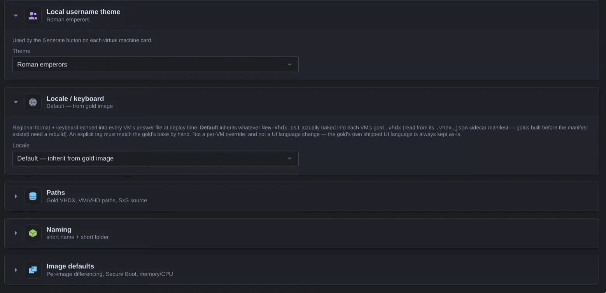

The password beside it is generated too: 32 characters, upper and lower case, a number and a
special, and no ambiguous glyphs — no `I`, `l`, `1`, `O` or `0` — because somebody will read it
off a console at some point.

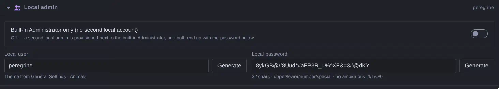

#### <picture><source media="(prefers-color-scheme: dark)" srcset=".github/assets/icons/language-dark.png"></picture> Locale / keyboard

Written into every VM's answer file at deploy time. Left on **Default**, each machine inherits
whatever its gold was baked with, read from the sidecar beside it. Set it explicitly only if it
matches the gold — this is a deploy-time echo, not a per-VM override, and it does not change
the UI language the image shipped with.

#### <picture><source media="(prefers-color-scheme: dark)" srcset=".github/assets/icons/storage-dark.png"></picture> Paths

Where things land on the host: the **VM path** (Hyper-V config folders), the **VHD path** (the
disks), the **gold directory** (blank means the `golds\` folder next to the scripts), and
the **SxS source** for .NET 3.5. All four sit behind a pencil — repointing where every machine
gets written should take a deliberate click, not a stray one.

Per VM, the build creates one folder under each root and names the disks after the machine:

<pre>
<picture><source media="(prefers-color-scheme: dark)" srcset=".github/assets/icons/storage-dark.svg"></picture> D:\vms\                          VM path — Hyper-V configuration
└─ <picture><source media="(prefers-color-scheme: dark)" srcset=".github/assets/icons/vm-dark.svg"></picture> dc-01\
<picture><source media="(prefers-color-scheme: dark)" srcset=".github/assets/icons/storage-dark.svg"></picture> D:\vhd\                          VHD path — the disks
└─ <picture><source media="(prefers-color-scheme: dark)" srcset=".github/assets/icons/files-dark.svg"></picture> dc-01\
   ├─ <picture><source media="(prefers-color-scheme: dark)" srcset=".github/assets/icons/disk-dark.svg"></picture> disk-dc01-c.vhdx           OS disk, child of the gold
   └─ <picture><source media="(prefers-color-scheme: dark)" srcset=".github/assets/icons/disk-dark.svg"></picture> disk-dc01-d.vhdx           data disk
</pre>

These are defaults, not decrees. Three things can outrank them, resolved per machine:

<picture>
  <source media="(prefers-color-scheme: dark)" srcset=".github/assets/paths-dark.png">
  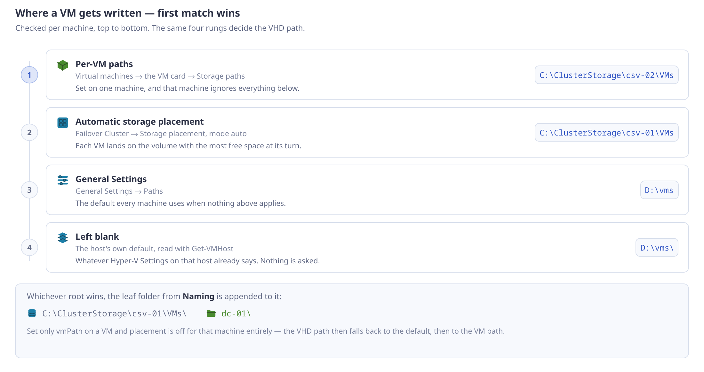
</picture>

The rung that catches people is the first one: a per-VM path takes that machine **out of
automatic storage placement altogether**. Pin one VM to a volume and it stays there while
everything else keeps spreading across your CSVs.

Leaving the paths blank is a good answer too — the build then uses whatever the host is
already configured to do. Two ways to see what that is:

<details>
<summary><b>Where the host's own defaults come from</b></summary>

**Hyper-V Manager** — *Hyper-V Settings → Virtual Hard Disks* and *Virtual Machines* are the
two folders every VM falls back to.

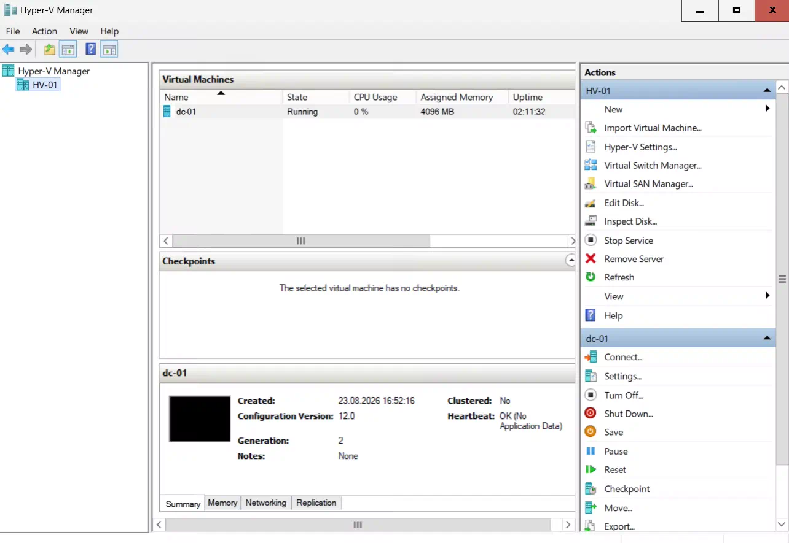

**PowerShell** — the same two values, and exactly what `Build-Vms.ps1` reads:

```powershell
Get-VMHost | Format-List VirtualMachinePath, VirtualHardDiskPath
```

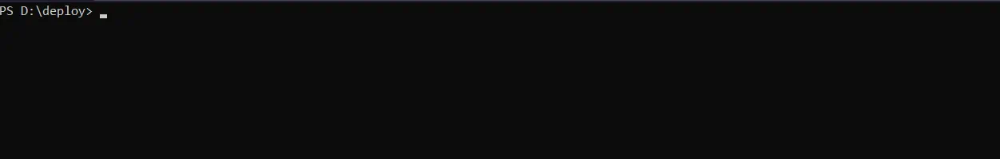

</details>

#### <picture><source media="(prefers-color-scheme: dark)" srcset=".github/assets/icons/vm-dark.svg"></picture> Naming

Two toggles that decide whether the Hyper-V object and its folders carry the domain FQDN:

| Toggle | Default | Effect |
|--------|---------|--------|
| VM name includes the FQDN | off | The Hyper-V name becomes `dc-01.ad.lab.tld` |
| Folder names include the FQDN | off | The leaf folder becomes `dc-01.ad.lab.tld\` |

<pre>
<picture><source media="(prefers-color-scheme: dark)" srcset=".github/assets/icons/hyperv-dark.png"></picture> Hyper-V Manager
└─ <picture><source media="(prefers-color-scheme: dark)" srcset=".github/assets/icons/vm-dark.svg"></picture> dc-01.ad.lab.tld               VM name, with the first toggle on
<picture><source media="(prefers-color-scheme: dark)" srcset=".github/assets/icons/storage-dark.svg"></picture> D:\vms\
└─ <picture><source media="(prefers-color-scheme: dark)" srcset=".github/assets/icons/files-dark.svg"></picture> dc-01.ad.lab.tld\             folder, with the second toggle on
<picture><source media="(prefers-color-scheme: dark)" srcset=".github/assets/icons/identity-dark.svg"></picture> Inside the guest the ComputerName stays dc-01 either way.
</pre>

Both toggles only apply to VMs with a resolvable domain join — everything else keeps its short
name everywhere, and the guest's own NetBIOS name is never affected.

#### <picture><source media="(prefers-color-scheme: dark)" srcset=".github/assets/icons/vlan-dark.svg"></picture> Available vSwitches

The switch names the Networks blade offers. They must match Hyper-V exactly — the studio takes
the string on faith, and preflight fails on a name no switch answers to.

<details>
<summary><b>Where the vSwitch names come from</b></summary>

**Hyper-V Manager** — *Actions → Virtual Switch Manager*. The **Name** box is the exact string
to type into the studio.

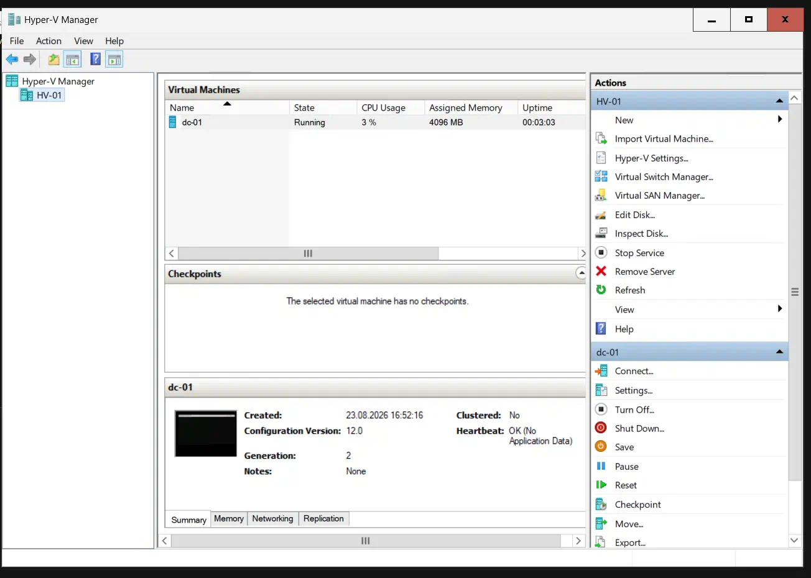

**PowerShell** — faster, and it prints the type and physical adapter beside each name:

```powershell
Get-VMSwitch | Format-Table Name, SwitchType, NetAdapterInterfaceDescription
```

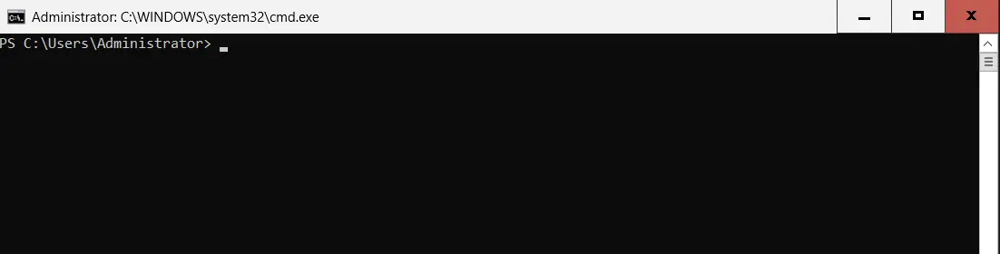

</details>

### <picture><source media="(prefers-color-scheme: dark)" srcset=".github/assets/blades/networks-dark.png"></picture> Networks

A subnet defined once: <picture><source media="(prefers-color-scheme: dark)" srcset=".github/assets/icons/vnet-dark.svg"></picture> vSwitch, VLAN, network ID, gateway, DNS. Bind a VM to it
and its IP is checked against that subnet, not against "looks like an IP".

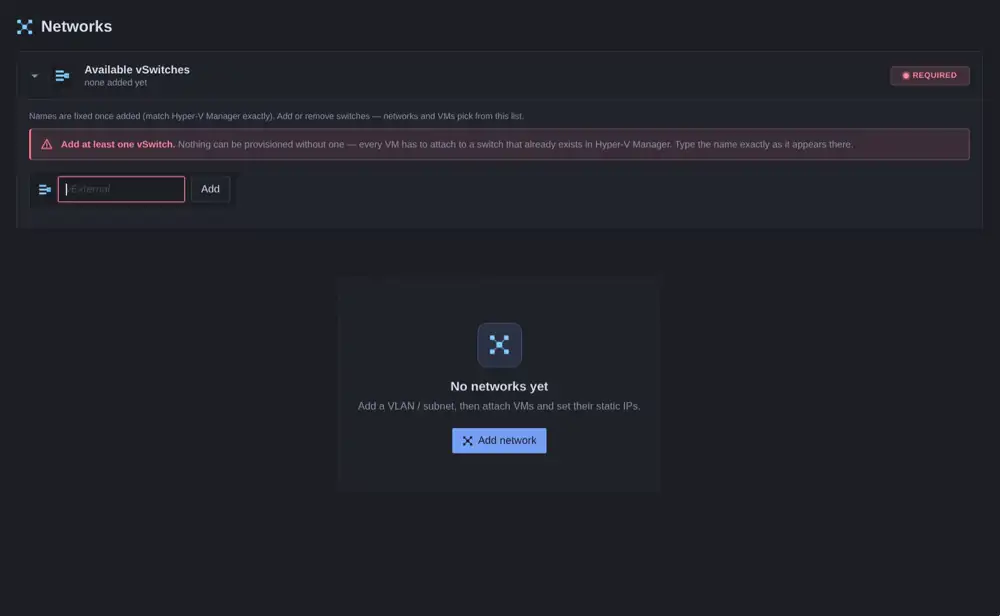

### <picture><source media="(prefers-color-scheme: dark)" srcset=".github/assets/blades/servers-dark.png"></picture> Virtual machines

One card per <picture><source media="(prefers-color-scheme: dark)" srcset=".github/assets/icons/vm-dark.svg"></picture> VM, top to bottom in the order you decide things. Cards collapse to a
summary line, so twelve machines still fit on a screen.

<pre>
<picture><source media="(prefers-color-scheme: dark)" srcset=".github/assets/icons/vm-dark.svg"></picture> VM card
├─ <picture><source media="(prefers-color-scheme: dark)" srcset=".github/assets/icons/shared-gallery-dark.svg"></picture> Template                       a whole VM already worked out
├─ <picture><source media="(prefers-color-scheme: dark)" srcset=".github/assets/icons/identity-dark.svg"></picture> Identity                       computer name + image
├─ <picture><source media="(prefers-color-scheme: dark)" srcset=".github/assets/icons/users-dark.svg"></picture> Local admin                    account, or Generate both
├─ <picture><source media="(prefers-color-scheme: dark)" srcset=".github/assets/icons/cpu-dark.svg"></picture> CPU / RAM
│  └─ <picture><source media="(prefers-color-scheme: dark)" srcset=".github/assets/icons/nested-virt-dark.svg"></picture> Additional processor options
├─ <picture><source media="(prefers-color-scheme: dark)" srcset=".github/assets/icons/vnet-dark.svg"></picture> Network                        adapters, networks, VLANs
├─ <picture><source media="(prefers-color-scheme: dark)" srcset=".github/assets/icons/disk-dark.svg"></picture> Disks                          data disks, formatted at first boot
├─ <picture><source media="(prefers-color-scheme: dark)" srcset=".github/assets/icons/extensions-dark.svg"></picture> Roles &amp; Features   <i>(Server)</i>   what the Add Roles wizard would install
├─ <picture><source media="(prefers-color-scheme: dark)" srcset=".github/assets/icons/client-apps-dark.svg"></picture> Built-in apps    <i>(client)</i>   strip the provisioned Store apps
├─ <picture><source media="(prefers-color-scheme: dark)" srcset=".github/assets/icons/storage-dark.svg"></picture> Storage paths                  per-VM overrides
├─ <picture><source media="(prefers-color-scheme: dark)" srcset=".github/assets/icons/secure-boot-dark.svg"></picture> Boot / disk                    Secure Boot, vTPM, differencing
├─ <picture><source media="(prefers-color-scheme: dark)" srcset=".github/assets/icons/start-action-dark.svg"></picture> Automatic start action
└─ <picture><source media="(prefers-color-scheme: dark)" srcset=".github/assets/icons/integration-dark.svg"></picture> Integration Services
</pre>

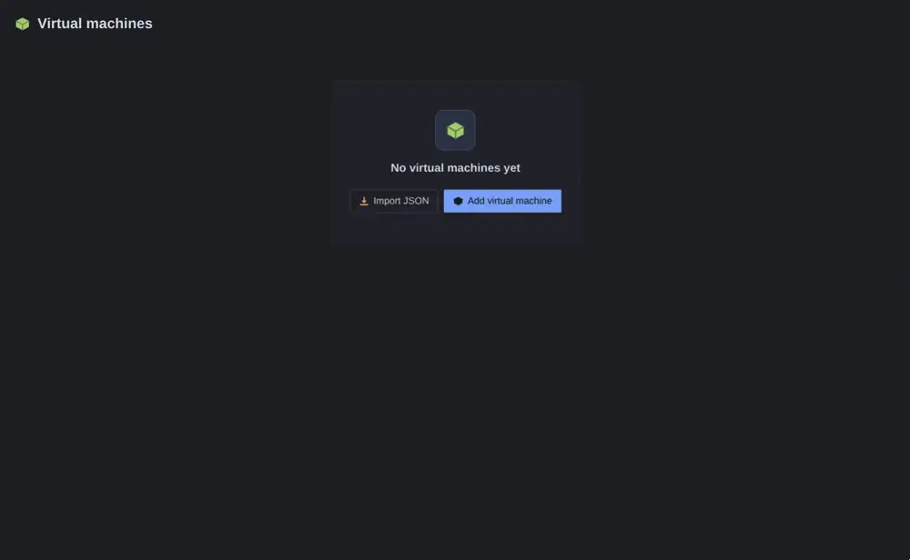

- <picture><source media="(prefers-color-scheme: dark)" srcset=".github/assets/icons/shared-gallery-dark.svg"></picture> **Template** — pick *Domain Controller* and the card fills itself in: edition, sizing, roles. Filter by release and edition; everything stays editable afterwards, and *no template* leaves the card as you built it.

  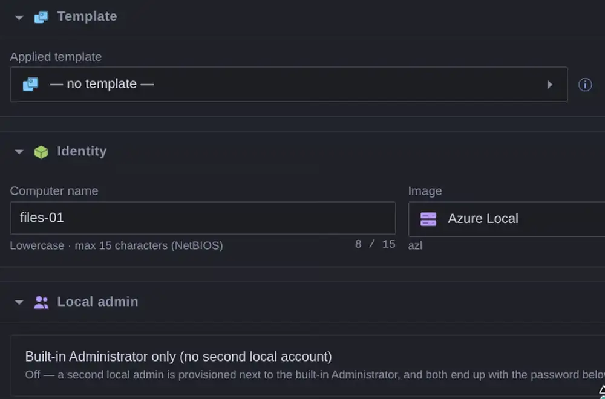
- <picture><source media="(prefers-color-scheme: dark)" srcset=".github/assets/icons/identity-dark.svg"></picture> **Identity** — names the machine, with NetBIOS rules enforced while you type and duplicates flagged on the spot, and picks its image.

  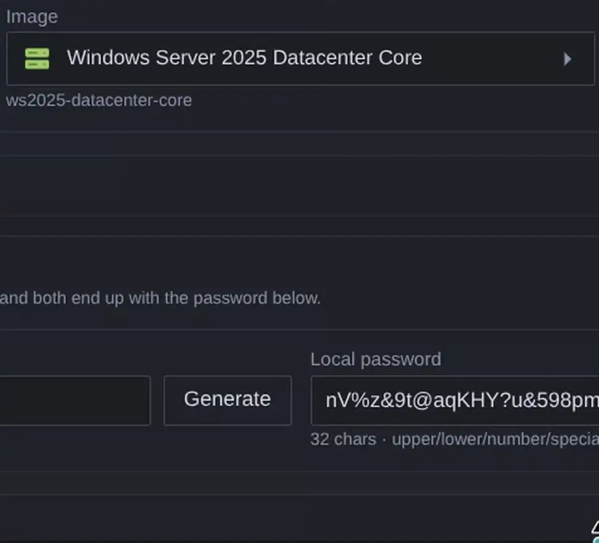

  > <picture><source media="(prefers-color-scheme: dark)" srcset=".github/assets/icons/help-dark.png"></picture> The picker lists what *can* be built, not what *is* built — the gold itself
  > has to exist, made with `New-Vhdx.ps1` up front. Preflight catches a missing one before
  > anything is created.
- <picture><source media="(prefers-color-scheme: dark)" srcset=".github/assets/icons/users-dark.svg"></picture> **Local admin** — takes a name and password, typed or generated. Server images can run as the built-in Administrator only; among clients, only Enterprise multi-session offers that tick.
- <picture><source media="(prefers-color-scheme: dark)" srcset=".github/assets/icons/cpu-dark.svg"></picture> **CPU / RAM** — sets memory and vCPUs; nested virtualization and processor compatibility hide under *Additional processor options*.
- <picture><source media="(prefers-color-scheme: dark)" srcset=".github/assets/icons/vnet-dark.svg"></picture> **Network** — binds the primary adapter to a network and adds more if you want them. Device naming is on, so the guest sees the adapter names you typed.
- <picture><source media="(prefers-color-scheme: dark)" srcset=".github/assets/icons/disk-dark.svg"></picture> **Disks** — the OS disk sits fixed at C:, its size and format decided when the gold was built. *Create and attach* adds data disks at D:, E:, … in order; each gets a size, Fixed or Dynamic, a filesystem and a volume label. At first boot the guest initializes the disk GPT, partitions it, formats it and mounts it on its letter with that label — *Leave raw* skips all of that and hands you a blank offline disk. File names follow the VM name (`disk-<server>-d.vhdx`) until the pencil pins one by hand. ReFS needs an Enterprise-class client image or a Server.

  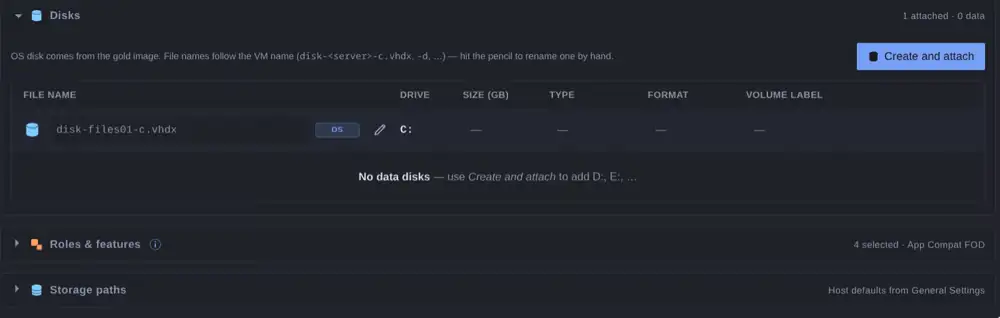
- <picture><source media="(prefers-color-scheme: dark)" srcset=".github/assets/icons/extensions-dark.svg"></picture> **Roles &amp; Features** *(Server)* — tick a role, get what the Add Roles wizard would install: role services nested, management tools alongside, sixteen roles from AD DS to WSUS. Windows features (Failover Clustering, MPIO, .NET 3.5…) sit beside them.
- <picture><source media="(prefers-color-scheme: dark)" srcset=".github/assets/icons/fod-dark.svg"></picture> **RSAT tools** *(client)* — the management consoles a workstation administers the lab from. **Hyper-V Management Tools** heads the list (Hyper-V Manager, `vmconnect`, the Hyper-V module — the platform stays off); it is an in-box optional feature rather than a Features on Demand capability, so it installs offline out of the image with no ISO. Everything under it is RSAT and wants the ISO described further down. *PAW essentials* ticks the privileged-workstation set, Hyper-V included.
- <picture><source media="(prefers-color-scheme: dark)" srcset=".github/assets/icons/client-apps-dark.svg"></picture> **Built-in apps** *(client)* — strips the provisioned Store apps offline, before first boot. Every app is individually tickable — all 43 by default, an "All apps" master row for the whole set — and a protected list (Store, Terminal, Notepad, Photos…) is never offered. All ticked exports the compact `removeBuiltInApps: true`; a custom pick exports `removeApps` with just those package ids.
- <picture><source media="(prefers-color-scheme: dark)" srcset=".github/assets/icons/secure-boot-dark.svg"></picture> **Boot / disk** — toggles Secure Boot and vTPM, and chooses a differencing disk versus a full copy of the gold.

  > <picture><source media="(prefers-color-scheme: dark)" srcset=".github/assets/icons/security-dark.png"></picture> **Differencing disks depend on the gold.** Every child references it by
  > path — move, rename or rebuild the gold and the VM stops booting. Pick a full copy for
  > anything that should outlive the golds folder.
- <picture><source media="(prefers-color-scheme: dark)" srcset=".github/assets/icons/start-action-dark.svg"></picture> **Automatic start action** — decides what the VM does when the host reboots.
- <picture><source media="(prefers-color-scheme: dark)" srcset=".github/assets/icons/integration-dark.svg"></picture> **Integration Services** — turns the six guest services on or off per VM.

### <picture><source media="(prefers-color-scheme: dark)" srcset=".github/assets/blades/vhdsets-dark.png"></picture> VHD Sets

Shared `.vhds` disks for guest clusters — the same <picture><source media="(prefers-color-scheme: dark)" srcset=".github/assets/icons/disk-pool-dark.svg"></picture> disk attached to two or
more VMs. Name it, size it, tick the machines; the name follows the members until you pin it.

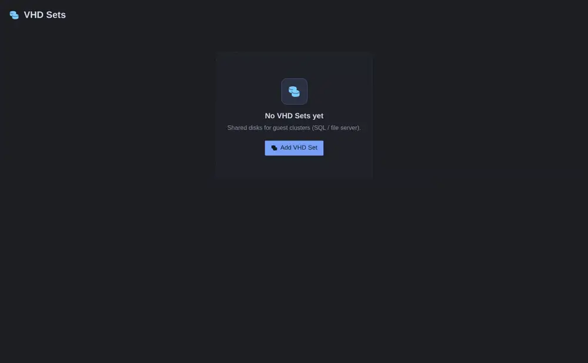

Each card is one shared disk:

- **File name** — generated from the attached members, `vhds-files01-files02-01.vhds` style,
  and it keeps re-deriving itself as you attach or rename VMs. Pin a custom name with the
  pencil and it stops following.
- **Size (GB)** and **Type** — Fixed or Dynamic, like any data disk.
- **Custom path (CSV / SMB 3)** — where the `.vhds` file lands. Leave it blank and the set is
  written to `{vhdPath}\vhds\` under the host default. Either way the location has to be a
  Cluster Shared Volume or an SMB 3 share.
- **Attach to guest cluster nodes** — the same VM picker as everywhere else. Every attached
  VM gets the disk as a shared `.vhds`; a set with no VMs attached is simply not built.

> <picture><source media="(prefers-color-scheme: dark)" srcset=".github/assets/icons/help-dark.svg"></picture> A shared disk needs a home every node can reach: a Cluster Shared Volume or an
> SMB 3 share. Preflight refuses anything else the moment the disk is actually shared —
> the other nodes cannot reach a path that exists on one host only.

### <picture><source media="(prefers-color-scheme: dark)" srcset=".github/assets/blades/cluster-dark.png"></picture> Failover Cluster

For when the host itself is a cluster member. Name the cluster, list your CSVs, tick the VMs
that become clustered roles — each lands on whichever volume has the most room, and
`Build-Vms.ps1` runs `Add-ClusterVirtualMachineRole` once the VM exists.

### <picture><source media="(prefers-color-scheme: dark)" srcset=".github/assets/blades/domainjoin-dark.png"></picture> Domain Join

<picture><source media="(prefers-color-scheme: dark)" srcset=".github/assets/icons/identity-dark.svg"></picture> Join accounts defined once, attached to VMs — one per tier or OU if you like,
with a target OU per machine. The join runs during Windows specialize, before anyone logs in —
or, per VM, from a self-erasing scheduled task once first-boot provisioning is done.

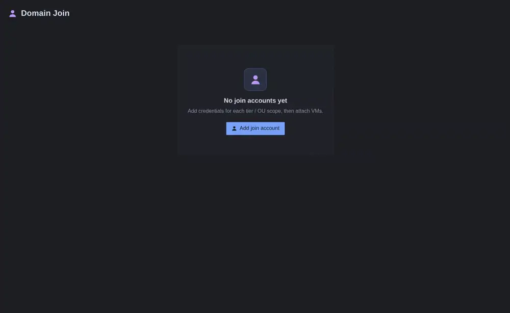

Each card is one join account: the **domain** to join, the **join user** allowed to create
computer objects (UPN form works well), and its **password**. All three are required — the
preflight blocks a build on an incomplete account. Add more cards when different machines
need different credentials; a VM can belong to only one account.

Attaching works two ways:

- **Use for every virtual machine** — one switch and the whole config joins with this
  account, including VMs you create later. It only appears when exactly one account exists;
  hand-picked assignments are kept and come back when you turn it off.
- **Choose virtual machines…** — a filterable picker per account, for mixed labs where only
  some machines join.

Every attached VM gets an **OU path** field — the distinguished name where its computer
object lands, e.g. `OU=Servers,OU=Tier0,DC=ad,DC=example,DC=invalid`. Leave it empty and the
machine goes to the domain's default container, `CN=Computers`.

Next to it sits **Join timing**:

- **Off — during specialize.** The unattend joins before anyone logs in. Simplest, one boot.
- **On — after first boot.** The unattend stays join-free. `GuestProvision.ps1` finishes
  everything else, seals the join credential with DPAPI (machine scope), and registers a
  SYSTEM scheduled task, `VmDeploy-DomainJoin`. A few minutes after Setup has let go of the
  machine the task joins the domain and OU, wipes the credential, its script and itself —
  on success **and** on failure — and reboots. Domain policy only ever meets a machine that
  is already fully provisioned; a hardened OU (CIS build kits, security baselines) can no
  longer interfere with first boot. A failed join leaves the VM in its workgroup and writes
  `domainJoin.result` into `C:\ProgramData\VmDeployLogs\state.json`.

Windows client VMs with an OU path start out **on**, everything else **off**; flip it per
VM. The studio exports the effective value as `domainJoin.mode` (`specialize` or
`deferred`), and `Build-Vms.ps1` follows it without applying the rule itself.

> <picture><source media="(prefers-color-scheme: dark)" srcset=".github/assets/icons/help-dark.svg"></picture> A domain-joined VM needs a static IP here, whichever timing it uses — the join
> has to find a domain controller before any DHCP lease would exist. DHCP elsewhere on the
> network is fine; this VM just doesn't use it.

### <picture><source media="(prefers-color-scheme: dark)" srcset=".github/assets/blades/azurearc-dark.png"></picture> Azure Arc

An Arc landing zone: subscription, tenant, resource group, region, and the service principal
allowed to onboard into it. Attach VMs; each pulls the Connected Machine agent at first boot
and registers itself.

Two auth modes:

| Mode | The secret | Host needs |
|------|------------|------------|
| <picture><source media="(prefers-color-scheme: dark)" srcset=".github/assets/icons/key-dark.svg"></picture> **Service principal** | Rides inside the guest briefly, deleted after the connect attempt | Nothing |
| <picture><source media="(prefers-color-scheme: dark)" srcset=".github/assets/icons/hyperv-dark.svg"></picture> **Host context** | Never enters the guest — the host onboards each VM over PowerShell Direct | `Az.ConnectedMachine` + a signed-in Az session |

Keep the secret out of `config.json` entirely with `-ArcServicePrincipalPath`.

For **host context**, check the host before building:

```powershell
Install-Module Az.ConnectedMachine -Scope AllUsers      # once
Get-AzContext | Format-List Account, Subscription, Tenant

# no context, or the wrong one?
Connect-AzAccount -Subscription "<subscription-id>"              # host with Desktop Experience
Connect-AzAccount -Subscription "<subscription-id>" -DeviceCode  # Core / no browser
```

> <picture><source media="(prefers-color-scheme: dark)" srcset=".github/assets/icons/help-dark.svg"></picture> `-DeviceCode` signs in from another device — Conditional Access must allow the
> device code flow for that account, or the sign-in is blocked before you ever see a prompt.

<details>
<summary><b>One-time Azure setup (app registration, role, resource providers)</b></summary>

```bash
az group create --name rg-arc-servers --location westeurope

az ad sp create-for-rbac --name "arc-vm-onboarding" --skip-assignment --years 1
# note appId, password, tenant

az role assignment create \
  --assignee <appId> \
  --role "Azure Connected Machine Onboarding" \
  --scope "/subscriptions/<subscriptionId>/resourceGroups/rg-arc-servers"

# Once per subscription — skipping this is the #1 cause of "azcmagent connect failed (exit 42)"
az provider register --namespace Microsoft.HybridCompute
az provider register --namespace Microsoft.GuestConfiguration
az provider register --namespace Microsoft.HybridConnectivity
az provider register --namespace Microsoft.Compute
```

</details>

### <picture><source media="(prefers-color-scheme: dark)" srcset=".github/assets/blades/review-dark.png"></picture> Review and validate

Everything you configured, summarized, plus every offline consistency check — duplicate names,
IPs outside their subnet, missing passwords, missing golds. Fix it here, not on the host.

### <picture><source media="(prefers-color-scheme: dark)" srcset=".github/assets/blades/passwords-dark.png"></picture> Passwords

Every generated local account password in one place — reveal, copy, regenerate.

> <picture><source media="(prefers-color-scheme: dark)" srcset=".github/assets/icons/security-dark.svg"></picture> They're written into `config.json` in plain text. Keep the file with the
> rest of the lab and delete it once `Build-Vms.ps1` has run.

### <picture><source media="(prefers-color-scheme: dark)" srcset=".github/assets/blades/export-dark.png"></picture> Export

Download <picture><source media="(prefers-color-scheme: dark)" srcset=".github/assets/icons/answer-file-dark.svg"></picture> `config.json` and drop it next to `Build-Vms.ps1`.

## <picture><source media="(prefers-color-scheme: dark)" srcset=".github/assets/icons/powershell-dark.png"></picture> Build the VMs — `Build-Vms.ps1`

```powershell
.\Build-Vms.ps1
```

Run it next to `config.json`. The home menu is grouped by what each entry acts on. Every row
says what it would touch right now, so you can see from the menu when a cleanup is due:

```text
  Virtual machines
  > Build all           every VM in servers.json (22)
    Build selected      pick one or more
    Check config        preflight every VM, change nothing

  Gold images
    Show golds          14 gold(s) of 9 image(s), 312.4 GiB
    Clean up golds      2 older, 1 leftover - 61.0 GiB to reclaim

    Quit
```

- **Build all** / **Build selected** — every VM, or a multi-select over them.
- **Check config** — the full preflight for every VM without touching the host, then back home.
  Every build runs the same preflight anyway before it creates anything.
- **Show golds** — every file in the gold folder, grouped by image and newest first: id,
  language, build, disk, bake date, size, status. The pane under the table shows the highlighted
  gold's region, source ISO or kernel, hash, and which VMs use it — the ones that would build
  from it today, and any existing VM whose disk is a differencing child of it.
- **Clean up golds** — the same table with ticks. Pre-ticked are only what is safe and stale:
  an older build or bake of the same image, language and disk size/type, a `bake-*.vhdx` from
  a bake that never finished, and a sidecar whose disk is gone. A gold that an
  existing VM is built on, or a file another process has open, is shown but cannot be ticked.
  The confirm screen lists every file and opens on *Keep*, and each file is checked again just
  before it is deleted.

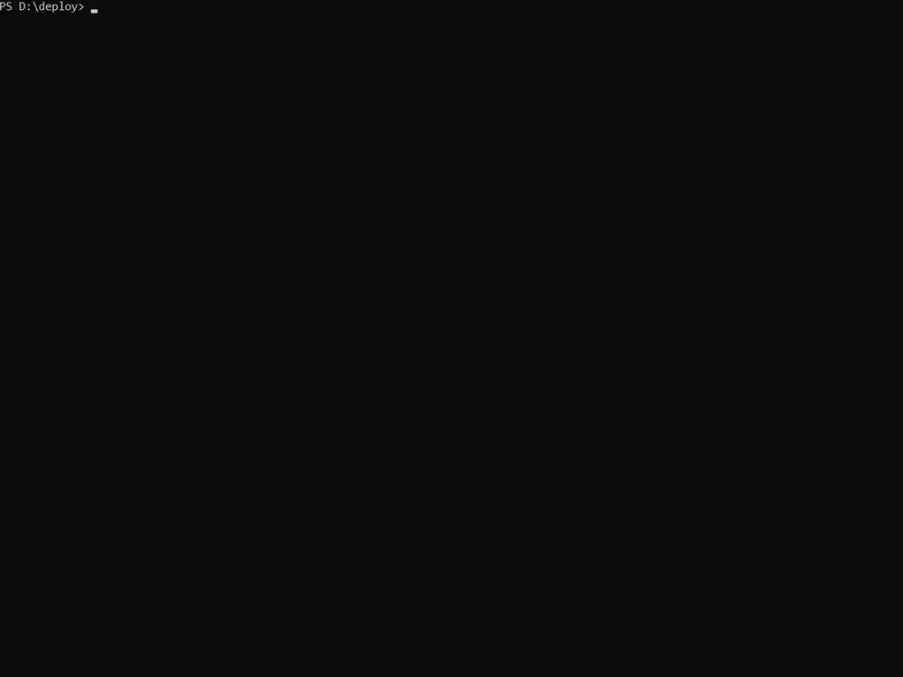

### <picture><source media="(prefers-color-scheme: dark)" srcset=".github/assets/icons/validate-dark.png"></picture> Preflight

Check verifies offline what would otherwise fail halfway through a build: every <picture><source media="(prefers-color-scheme: dark)" srcset=".github/assets/icons/vm-dark.svg"></picture> VM
resolves a gold, its generated answer file actually parses, its vSwitch exists on the host, its
password is present, names and IPs are unique and inside their subnets, and every shared
<picture><source media="(prefers-color-scheme: dark)" srcset=".github/assets/icons/disk-pool-dark.svg"></picture> VHD Set sits on storage that supports sharing. Errors block the build;
warnings don't.

Two questions may come up before it runs:

- <picture><source media="(prefers-color-scheme: dark)" srcset=".github/assets/icons/language-dark.svg"></picture> **Gold images** — if an image has more than one gold (another language,
  build or disk size), one card settles it for the whole run: the newest gold of each image, one
  language everywhere it exists, or per VM with Left/Right. Each row shows language, build, disk,
  bake date and id; the pane under the list shows the highlighted gold's full sidecar. VMs with a
  single gold are shown locked. Unattended, the newest build wins (`-GoldId` pins one).

  ```text
  Pick per VM                              lang   build       disk          baked       id
    > dc-01   ws2025-datacenter-core  < en-US  26100.4061  127 GB fixed  2026-09-30  3f9a2c1e >   1 of 2
      fs-01   ws2025-datacenter-core  < de-DE  26100.1742  60 GB dyn     2026-09-12  a71b03d4 >   2 of 2
      lx-01   ubuntu2604                en-US  26.04       32 GB dyn     2026-09-25  0c1d2e3f     only gold
  ```
- <picture><source media="(prefers-color-scheme: dark)" srcset=".github/assets/icons/fod-dark.png"></picture> **Features on Demand** — see below.

<!-- SCREENSHOT: gold picker card -->

### <picture><source media="(prefers-color-scheme: dark)" srcset=".github/assets/icons/fod-dark.png"></picture> Features on Demand — RSAT and the App Compatibility pack

Two things a VM card can ask for don't live in the install image: **RSAT** on Windows 11
(the AD, DNS, DHCP and friends management tools) and the **Server Core App Compatibility
pack** (mmc, Event Viewer, perfmon and other GUI leftovers on a Core server). Windows ships
them separately, as Features on Demand.

If any selected VM wants one, `Build-Vms.ps1` asks once per run — one card for the Server
FOD per release, one for all Windows 11 RSAT — with three answers:

- **Select FoD ISO** — browse to the *Languages and Optional Features* ISO matching that
  Windows release. The build mounts it and installs everything offline, straight into the
  VHD, before the VM ever boots.
- **Install in guest** — each VM pulls the payload from Windows Update at first boot.
- **Skip** — the VMs build without them.

Hyper-V Manager is not one of them, despite sitting in the same list: the client Hyper-V tools
are an in-box optional feature, not an RSAT capability, so that row installs offline out of the
image with no ISO involved.

Give it the ISO. The online path adds minutes to every first boot and needs internet — or a
WSUS that allows optional content, without which every download fails. RSAT is the worst
case: each capability is a separate Windows Update download, per VM. The offline install is
one mount and a few seconds each.

> <picture><source media="(prefers-color-scheme: dark)" srcset=".github/assets/icons/help-dark.svg"></picture> A Windows 11 VM with RSAT baked in from the ISO takes noticeably longer at the
> **first** login — Windows is finishing the staged capabilities. One-time cost; every login
> after that is normal.

### <picture><source media="(prefers-color-scheme: dark)" srcset=".github/assets/icons/hyperv-dark.png"></picture> What a build does, per VM

The OS disk comes first — a differencing disk off the gold by default, or a full copy if the
card says so. Then the VM itself: adapters renamed to what you typed (device naming on, VLANs
applied), data disks created empty, VHD Sets attached, the automatic start action set. The
per-VM `unattend.xml` goes into the disk along with a first-boot payload, the VM joins the
host cluster if you marked it, and it starts — unless you said not to.

At first boot the guest takes over: it formats and mounts its data disks, renames its adapters
from the inside, installs any online Features on Demand, joins the domain during specialize,
and onboards to <picture><source media="(prefers-color-scheme: dark)" srcset=".github/assets/icons/azure-dark.png"></picture> Azure Arc. You watch it happen from the outside — there is
nothing to click.

> <picture><source media="(prefers-color-scheme: dark)" srcset=".github/assets/icons/security-dark.png"></picture> **Differencing disks depend on the gold.** Every child references it by
> path — move, rename or rebuild the gold and every VM built from it stops booting. A full
> copy has no such string attached.

**A Linux VM** gets a cloud-init seed instead of an answer file: a small disk labelled
`CIDATA` carrying the user, the password, the host name and the network settings. The build
starts the VM for its first boot and waits for it to power off — cloud-init does that once it
is done. In that boot the guest joins the domain, onboards to Arc, removes
the kernel the gold was baked on (Ubuntu), and finally deletes its own copies of the seed. The host
then detaches and deletes the seed disk, which holds the password in clear. A VM that never
powers off keeps its seed attached, so it can still be looked at.

Two details worth knowing. Windows redacts the passwords inside the answer file once Setup has
used them. And with host-context Arc, the host waits for PowerShell Direct after each start
and onboards the VM itself, so the secret never enters the guest.

<details>
<summary><b>Example run log</b> — two of four VMs, a Win11 client and a Server Core DC</summary>

```text
2026-08-30 14:52:42 [ info  ] Server 'avd-01' -> gold 'D:\deploy\golds\hv-a71b03d4.vhdx' (imageId=w11-enterprise-ms)
2026-08-30 14:52:42 [ run   ] Copying gold image to 'D:\vhd\avd-01\disk-avd01-c.vhdx'
2026-08-30 14:52:42 [ run   ] Creating Gen2 VM 'avd-01' (8 GB / 4 CPU)
2026-08-30 14:52:43 [ run   ] VLAN 10 set on 'avd-01'
2026-08-30 14:52:43 [ run   ] Automatic start action 'StartIfRunning' (0s delay) on 'avd-01'
2026-08-30 14:52:43 [ run   ] Enabled vTPM on 'avd-01'
2026-08-30 14:52:43 [ run   ] Applied Integration Services on 'avd-01' (Time Synchronization=False)
2026-08-30 14:52:43 [ info  ] Adapter 'vnic-01' MAC = 00-15-5D-69-F6-8C
2026-08-30 14:52:43 [ run   ] Injecting unattend into 'D:\vhd\avd-01\disk-avd01-c.vhdx'
2026-08-30 14:52:44 [ run   ] Clearing offline UnattendFile registry pointer
2026-08-30 14:52:44 [ run   ] Removing leftover 'F:\Windows\Panther\UnattendGC'
2026-08-30 14:52:44 [ info  ] Wrote 'F:\Windows\Panther\unattend.xml' (5132 bytes)
2026-08-30 14:52:44 [ run   ] Setting offline client OOBE registry bypasses
2026-08-30 14:52:44 [ o.k.  ] Injected GuestProvision payload + SetupComplete.cmd
2026-08-30 14:52:44 [ info  ] Client image - Win11 OOBE skips applied
2026-08-30 14:52:44 [ run   ] Starting VM 'avd-01'
2026-08-30 14:52:45 [ o.k.  ] Provisioned 'avd-01' successfully
2026-08-30 14:52:47 [ info  ] Server 'dc-01' -> gold 'D:\deploy\golds\hv-3f9a2c1e.vhdx' (imageId=ws2025-datacenter-core)
2026-08-30 14:52:47 [ run   ] Copying gold image to 'D:\vhd\dc-01\disk-dc01-c.vhdx'
2026-08-30 14:52:47 [ run   ] Creating Gen2 VM 'dc-01' (4 GB / 2 CPU)
2026-08-30 14:52:48 [ run   ] VLAN 10 set on 'dc-01'
2026-08-30 14:52:48 [ run   ] Automatic start action 'StartIfRunning' (0s delay) on 'dc-01'
2026-08-30 14:52:48 [ run   ] Applied Integration Services on 'dc-01' (Time Synchronization=False)
2026-08-30 14:52:48 [ info  ] Adapter 'vnic-01' MAC = 00-15-5D-1E-62-18
2026-08-30 14:52:48 [ run   ] Injecting unattend into 'D:\vhd\dc-01\disk-dc01-c.vhdx'
2026-08-30 14:52:48 [ run   ] Clearing offline UnattendFile registry pointer
2026-08-30 14:52:49 [ run   ] Removing leftover 'F:\Windows\Panther\UnattendGC'
2026-08-30 14:52:49 [ info  ] Wrote 'F:\Windows\Panther\unattend.xml' (4411 bytes)
2026-08-30 14:52:49 [ run   ] Installing Server Core App Compatibility FOD offline from 'E:\LanguagesAndOptionalFeatures'
2026-08-30 14:53:22 [ o.k.  ] Server Core App Compatibility FOD OK (RestartNeeded=False)
2026-08-30 14:53:22 [ o.k.  ] Injected GuestProvision payload + SetupComplete.cmd
2026-08-30 14:53:22 [ run   ] Installing 3 Windows feature(s) offline into VHD
2026-08-30 14:54:18 [ o.k.  ] Offline feature 'AD-Domain-Services' OK
2026-08-30 14:54:44 [ o.k.  ] Offline feature 'RSAT-ADDS-Tools' OK
2026-08-30 14:54:46 [ o.k.  ] Offline feature 'RSAT-AD-PowerShell' OK
2026-08-30 14:55:01 [ run   ] Starting VM 'dc-01'
2026-08-30 14:55:01 [ o.k.  ] Provisioned 'dc-01' successfully
2026-08-30 14:55:07 [ o.k.  ] All selected servers provisioned successfully
2026-08-30 14:55:07 [ info  ] Runtime 00:02:41.73
```

</details>

### <picture><source media="(prefers-color-scheme: dark)" srcset=".github/assets/icons/storage-dark.png"></picture> Slow storage

**Slow host mode** reorders the run for spinning disks or a busy CSV: first every disk is
created, then every VM, then everything starts. Nothing competes with a 60 GB copy for IO.

<details>
<summary><b>Parameters, for scripted builds</b></summary>

The menu is the intended way in. For a build that has become routine:

```powershell
.\Build-Vms.ps1 -CheckOnly                          # validate, change nothing
.\Build-Vms.ps1 -BuildAll                           # everything in config.json
.\Build-Vms.ps1 -VmName 'dc-01','app-01' -SkipStart # some VMs, left off
.\Build-Vms.ps1 -BuildAll -GoldLanguage en-US       # prefer en-US golds where an image has several
.\Build-Vms.ps1 -BuildAll -GoldId 3f9a2c1e          # pin that gold for VMs of its imageId
.\Build-Vms.ps1 -BuildAll -SlowHost                 # slow storage mode
.\Build-Vms.ps1 -BuildAll -ArcServicePrincipalPath .\arc-deploy.json
.\Build-Vms.ps1 -ConfigPath 'D:\Lab\config.json' -BuildAll
```

</details>

## <picture><source media="(prefers-color-scheme: dark)" srcset=".github/assets/icons/update-dark.png"></picture> Toolbox

A few scripts that grew out of testing this project — a host needed wiping, fixed disks had
eaten a volume, a finished lab had to go. They kept earning their place, so they ship with it.
Same menu style as `Build-Vms.ps1`.

> <picture><source media="(prefers-color-scheme: dark)" srcset=".github/assets/icons/security-dark.png"></picture> **Lab use only.** These move, shrink and delete real VMs. Never point them
> at a production host.

| Script | Does |
|--------|------|
| `toolbox\Move-Vms.ps1` | Export VMs (and vTPM certs, and optionally switches) to a disk or share before a host reinstall; import them back after. Check mode validates a package first. |
| `toolbox\Convert-Vhdx.ps1` | Convert Fixed disks to Dynamic and actually reclaim the space — guest ReTrim, zero fallback, host compact. |
| `toolbox\Remove-Vms.ps1` | Tear the lab down: cluster role, VM, disks, folders. **Permanent** — check the selection twice. |
| `toolbox\Repair-VmPlacement.ps1` | Find VMs whose config or disks are not in `<VM path>\<name>\` / `<VHD path>\<name>\` the way Build-Vms puts them, and move them there, picked per VM — shut down cleanly first by default, or live. |

## <picture><source media="(prefers-color-scheme: dark)" srcset=".github/assets/icons/files-dark.png"></picture> Reference

### <picture><source media="(prefers-color-scheme: dark)" srcset=".github/assets/icons/files-dark.png"></picture> Repository layout

<pre>
<picture><source media="(prefers-color-scheme: dark)" srcset=".github/assets/icons/files-dark.png"></picture> HyperV-VM-Studio
├─ <picture><source media="(prefers-color-scheme: dark)" srcset=".github/assets/icons/powershell-dark.png"></picture> New-Vhdx.ps1                gold image builder
├─ <picture><source media="(prefers-color-scheme: dark)" srcset=".github/assets/icons/powershell-dark.png"></picture> Build-Vms.ps1               provisioning engine
├─ <picture><source media="(prefers-color-scheme: dark)" srcset=".github/assets/icons/monitor-dark.png"></picture> html\hyperv-vm-studio.html    the studio
├─ <picture><source media="(prefers-color-scheme: dark)" srcset=".github/assets/icons/integration-dark.png"></picture> guest-files\                first-boot payloads injected per VM
├─ <picture><source media="(prefers-color-scheme: dark)" srcset=".github/assets/icons/update-dark.png"></picture> toolbox\                    migrate / convert / remove
├─ <picture><source media="(prefers-color-scheme: dark)" srcset=".github/assets/icons/iso-media-dark.png"></picture> media\                      your ISOs, cloud image cache
├─ <picture><source media="(prefers-color-scheme: dark)" srcset=".github/assets/icons/gold-image-dark.png"></picture> golds\                      built golds
└─ <picture><source media="(prefers-color-scheme: dark)" srcset=".github/assets/icons/monitor-dark.png"></picture> logs\                       one timestamped log per run
</pre>

### <picture><source media="(prefers-color-scheme: dark)" srcset=".github/assets/icons/monitor-dark.png"></picture> Logs

Host: `logs\<script>\yyyyMMdd-HHmm.log`, tagged `[ info ] [ o.k. ] [ warn ] [ error ]`.
Guest: `C:\ProgramData\VmDeployLogs\<yyyyMMdd-HHmm>.log` plus `state.json` (what was done, and whether it succeeded), same format. The payload itself (`C:\Windows\Setup\Scripts\GuestProvision\` and `SetupComplete.cmd`) deletes itself after a successful run; after a failed one it stays so it can be run again by hand.

### <picture><source media="(prefers-color-scheme: dark)" srcset=".github/assets/icons/security-dark.png"></picture> Security

| Secret | Lives in | Do |
|--------|----------|-----|
| Local admin passwords | `config.json`, then the unattend (redacted by Setup after use) | Delete `config.json` after the build |
| Domain join password | same | Least-privilege join account, rotate after labs |
| Arc SP secret | `config.json` or a one-time file in the guest, deleted after connect | Prefer `-ArcServicePrincipalPath` or host-context mode |

### <picture><source media="(prefers-color-scheme: dark)" srcset=".github/assets/icons/help-dark.png"></picture> Troubleshooting

| Symptom | Fix |
|---------|-----|
| `Config not found` | Export from the studio, save next to `Build-Vms.ps1` |
| `No gold image for imageId=…` | Build that edition with `New-Vhdx.ps1`; check `golds\` and that each gold has its `.vhdx.json` |
| Wrong gold picked unattended | Several golds for one image: the newest build wins. Pin one with `-GoldId`, or prefer a language with `-GoldLanguage` / the studio locale |
| Linux bake log: `BAKE-PKG <name> MISSING` | The gold came out without that package — usually a mirror the bake VM could not reach. Check the bake switch and addressing, then bake again |
| Linux bake: `The package manager failed during the bake` | apt or dnf errored, so the gold may be missing updates. The `distros[ERROR]` line above it says which step; usually a mirror the bake VM could not reach. Fix the network or pick another mirror, then bake again |
| Linux VM `did not power off` | cloud-init is still working or failed. Log in on the Hyper-V console and read `/var/log/cloud-init-output.log`; the seed stays attached until you remove it |
| Linux domain user: `no such user` after a join | `systemctl is-active sssd` — the join is only usable once sssd runs |
| Preflight: switch missing | Create the vSwitch; the name in Networks must match exactly |
| Name too long | 15 NetBIOS characters, lowercase |
| `…does not support virtual hard disk sharing` | Put the `.vhds` on CSV or SMB 3 |
| Anything else | The log names the step that failed — host log first, then the guest log |

```powershell
Get-ChildItem .\golds -Filter 'hv-*.vhdx.json' | ForEach-Object { Get-Content $_.FullName -Raw | ConvertFrom-Json } |
    Format-Table id, imageId, language, build, diskSizeGB, vhdType, createdUtc
Get-VMSwitch | Format-Table Name, SwitchType
```
